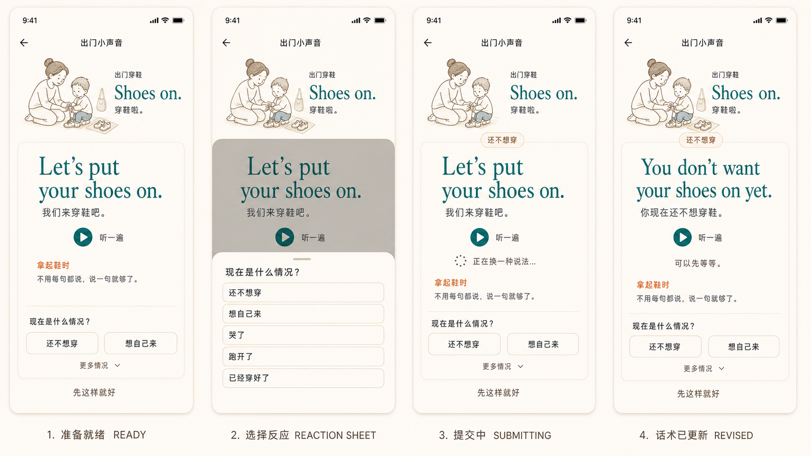
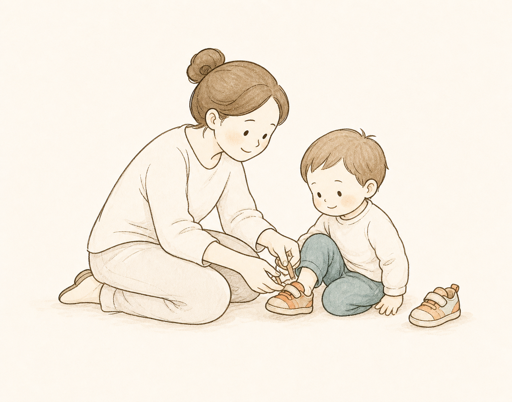

# Phase 41 - Schematic Design Gate

**Status:** approved
**Approved prototype:** `assets/prototypes/phase41-d4-5-interaction-engine.png`
**Approved runtime illustration:** `mobile_v2/assets/illustrations/rituals/shoes_on/shoes_on_approved_v1.png`
**Updated:** 2026-06-19
**Scope:** Phase 41 `mobile_v2` runnable mock-API-backed slice before execute-phase coding

## 2026-06-17 Product Correction

## 2026-06-19 Interaction Engine Override

This schematic is controlled by `41-INTERACTION-ENGINE-CONTRACT.md`.

The product is not a fixed phrase sheet or a terminal `reaction -> sentence`
tool. It is an evolving interaction system whose UI is a low-cognitive-load
projection. The current Phase 41 fallback may expose only reaction choices, but
the engine must fully execute voice observation, free-text observation, future
signals, accumulated context, and strategy evolution. Those channels are only
hidden from this projection.

The approved D.4.5 prototype is one Ritual Room screen shown in multiple states:

1. stable Ritual identity and anchor
2. default action-bound utterance
3. inline or bottom-sheet contextual reaction selection
4. submitting/recoverable state
5. in-place revised utterance with current context
6. another context submission proving the room remains stable while the
   interaction snapshot evolves

There is no page-navigation loop between these states.

Phase 41 no longer models the first micro-ritual as a four-screen flow. The old First Entry -> Today Orientation -> Room Support -> Memory Lens sequence is superseded for product design and execution planning.

The corrected core model is:

```text
Ritual Room = real family scene
  + approved parent-child line illustration
  + anchor phrase
  + optional phrase set
  + action / TPR cues
  + evolving interaction context
  + current speakable utterance
```

For Phase 41, the single supported ritual is:

| Field | Value |
|-------|-------|
| ritualRoomId | `shoes_on_room_v1` |
| roomName | `出门小声音` |
| routineAnchor | `出门穿鞋` |
| anchorPhrase | `Shoes on.` |
| chineseHelper | `穿鞋啦。` |
| illustration | approved static `shoes_on` parent-child line illustration |
| reassurance | `宝宝不用跟读，也不用回应。你继续穿鞋就好。` |
| exit | `先这样就好` |

## Phase 41 IA

Phase 41 should implement one core surface:

```text
Ritual Room Support
```

It should not implement a per-ritual First Entry page. Entry belongs to a future Ritual List / collection surface, analogous to selecting a song from a playlist and opening the playback page directly.

Today Orientation is not a separate screen. Its useful work becomes a small permission/orientation line inside Room Support: one tiny family sound is enough, and the parent can simply speak along with the real action.

Memory Lens is not the core Phase 41 experience. It may appear only after the parent exits/rests, and Phase 41 must not implement full memory tracking or production Garden Memory transitions.

## Content Source Contract

All ritual-specific content must be obtained through a backend-shaped API contract. Widgets, controllers, themes, and route code must not directly hardcode `Shoes on.`, Chinese helper copy, reassurance, phrase sets, action / TPR cues, illustration references, audio references, section labels, or ritual exit copy.

Phase 41 uses a `MockRitualInteractionApi` implementation for the demo. It does
not call a deployed backend and does not implement LLM generation, microphone
capture/STT, visible free-text entry, automatic signal production, or full
memory tracking. The mock engine does implement all normalized input variants:
reaction, voice transcript observation, free text, typed future signal, and
strategy preference. It returns interaction snapshots through the same
repository boundary a future real backend adapter will implement.

The mock response is the single demo content source and should include:

- ritual identity and room metadata
- approved illustration asset reference and lifecycle status
- anchor phrase and Chinese helper
- no-response reassurance
- one bootstrap/current utterance suggestion and Chinese situational helper
- one current action / TPR timing cue
- neutral context choices, reaction-sheet title, and submitting copy
- current-utterance optional audio reference or playback availability
- quiet exit copy
- optional post-exit Memory Lens copy only if that prompt remains in Phase 41

The API response should contain one complete current caregiver utterance and at
most one action timing cue. Additional variants are engine behavior, not a
visible Phase 41 list. Do not label contextual revision `下一句`, `next phrase`,
a lesson step, or a checklist.

Required demo boundary:

```text
RitualContentApi -> RitualRoomRepository -> RitualRoomContent
RitualInteractionApi -> RitualInteractionRepository
  -> RitualInteractionSnapshot
  -> RitualRoomController load/submit/retry state
  -> Ritual Room Support widgets
```

Mock payload values may live in one dedicated mock response fixture or JSON asset. They must not be duplicated in widgets or controller branches.

Presentation code consumes only domain models and controller state. It must not
import transport DTOs, the mock data source, or the JSON fixture.

Required loading states:

- loading
- ready
- recoverable error with retry

Tests must prove the rendered ritual content comes from an injected mock API response by changing test payload values and observing the changed UI. Exact production copy assertions alone are insufficient because hardcoded widgets could pass them.

## Historical D.4.3 Room Support Layout

D.4.3 established the useful compact-identity / practical-content hierarchy,
but its three-row family talk sheet is historical. It must not be implemented
as the Phase 41 projection. The approved D.4.5 direction replaces it with one
current utterance and in-place contextual revision.

1. The identity header occupies about 22-26% of the viewport.
2. The approved parent-child line illustration is 96-112dp and sits beside the
   ritual identity.
3. The header contains only `Shoes on.`, `出门穿鞋`, and `穿鞋啦。`.
4. Remove the header intro and the label `日常动作`.
5. The first English utterance must be the first strong visual focus. The first
   action moment and the beginning of the second should be visible without
   scrolling on a 390x844 viewport.
6. The body heading is `现在可以这样说`.
7. The play-all affordance is `连起来听`.
8. The historical three-action composition is reference-only.
9. D.4.5 renders one current utterance, one action timing cue, one play/pause
   control, neutral context input, reassurance, and quiet exit.

### Historical D.4.3 Action Moments

The parent is assumed to understand English but not confidently generate natural
caregiver speech. Short fragments therefore cannot be the primary support content.
The backend-owned content model must provide complete sayable utterances:

| Action cue | Minimum utterance | Optional continuation | Chinese action helper |
|---|---|---|
| `拿起鞋时` | `Let's put your shoes on.` | none | `拿起鞋，就说这一句。` |
| `穿第一只时` | `Let's put this shoe on first.` | `Now let's put the other one on.` | `第一只穿好，再接第二句。` |
| `穿好后` | `Your shoes are on.` | `All done. Let's go.` | `穿好后，顺口收尾。` |

These rows document product exploration only. Phase 41 does not render them as
a list and does not ask the parent to choose or progress through them.

### D.4.3 Prototype Reference

- Generated and iterated in the active Codex thread on 2026-06-18.
- The latest preview removes plant/leaf imagery, row illustration icons, the
  floating body card, duplicate per-line audio icons, the overflow menu, and the
  task-like filled exit button.
- ImageGen text rendering is a visual-layout reference, not copy authority.
  D.4.3 copy is historical; exact runtime examples follow `41-UI-SPEC.md`.
- The music-list screenshot supplied by the user is a hierarchy reference only:
  compact collection identity above a large practical list.
- The prototype does not copy the music application's dark theme, brand, social
  metrics, album art, or playback product semantics.
- Share, comment, favorite, and social-count actions are deferred and are not
  rendered as disabled placeholders in Phase 41.
- The D.4.2 preview remains historical and is not an approved execution target.
- D.4.3 is not an execution target.

## Approved D.4.5 Interaction Engine Prototype



The user approved the current direction by asking that the new prototype be
saved as the Phase 41 record and that required assets be generated. D.4.5 is
therefore the execution reference.

The board shows four states of the same `Ritual Room Support` screen:

| State | Visible behavior |
|---|---|
| Ready | Stable room identity, compact caregiver-child illustration, one current complete caregiver utterance, one action timing cue, one audio affordance, neutral reaction choices, reassurance, and quiet exit. |
| Reaction sheet | A half-height Material sheet adds neutral reaction choices without leaving or replacing the room screen. |
| Submitting | The last usable utterance remains visible while a small inline pending indicator reports that wording is being adjusted. |
| Revised | Stable room identity remains; context label and current utterance update in place from the new interaction snapshot. |

The prototype is geometry authority, not literal image-copy authority. Runtime
copy comes from the mock API and the exact examples in `41-UI-SPEC.md`.
ImageGen rendering artifacts must not be copied blindly.

D.4.5 deliberately contains:

- one current caregiver utterance, not a phrase list
- one small action / TPR timing cue, not a multi-step action list
- text-only neutral context choices
- reaction selection as the only visible Phase 41 input channel
- no microphone, free-text field, future-signal control, or strategy tray
- no page transition between context submission and revised wording
- no task-like filled CTA
- no child-performance, completion, lesson, progress, reward, or Garden
  semantics

## Phase 41 Asset Manifest

Phase 41 consumes assets but does not implement the Ritual Illustration System:

| Asset | Phase 41 rule |
|---|---|
| `shoes_on_approved_v1` illustration | **Approved.** `mobile_v2/assets/illustrations/rituals/shoes_on/shoes_on_approved_v1.png`. One static caregiver-and-toddler line illustration; warm paper-compatible; no photo-real elements. |
| Play/pause icon | Flutter Material icon with a filled warm circular surface and 48x48 minimum hit target. |
| Room mark | Not required in Phase 41. Do not generate a decorative substitute. |
| Audio metadata | Supplied by mock API content; Phase 41 may use a fake/no-op playback callback and does not add a production audio service. |
| Memory mark | Not required. If the optional Memory Lens remains, use typography and spacing rather than a leaf/growth symbol. |

### Approved Illustration Reference



Generation record:

- Generated with the built-in ImageGen tool on 2026-06-19.
- Warm charcoal/sepia family line art with restrained muted teal/orange wash.
- Same caregiver/toddler visual grammar as D.4.5.
- Flat warm-paper background; no photo-real room, classroom, leaf, growth,
  reward, or task imagery.
- This is a static Phase 41 asset. Phase 41 does not implement illustration
  generation or lifecycle services.

## Forbidden Semantics

Do not use:

- `下一句`
- child-performance tracking such as `孩子有没有照做？`
- reaction choices presented as reporting, grading, or diagnosing the child
- `孩子有没有照做？`
- `做对了`
- `完成动作`
- `完成练习`
- `今日任务`
- `说了 1/3`
- `继续下一句`
- `打卡成功`
- `宝宝学会了吗`
- progress, score, streak, badge, reward, growth, unlock, checklist, lesson, or classroom framing
- Garden, leaf, sprout, plant, growth, star, medal, trophy, or checkmark imagery
- backend, AI, model, confidence, or generation words in the Phase 41 UI
- direct ritual-content literals duplicated inside widgets, controllers, routes, or themes

## Phase 46 Handoff

Phase 46 owns the Ritual Illustration System and future Ritual Grammar work:

- Each ritual may have an approved illustration asset.
- Each ritual should also have action / TPR grammar.
- New rituals without approved illustration assets may later use backend AI image generation with caregiver / child reference characters and a shared Ritual Illustration Grammar.
- None of that generation pipeline belongs to Phase 41.

## Prototype Gate

D.4.4 remains the historical visual baseline. D.4.5 is the approved
single-image, multi-state Interaction Engine execution reference and satisfies
this schematic:

- one core `Ritual Room Support` mobile screen
- parent-child line illustration
- compact ritual identity header using about one quarter of the viewport
- `Shoes on.` as the ritual title
- one current speakable utterance as the main output focus
- action cues and default complete caregiver utterances available without
  turning the screen into a course list
- neutral contextual reaction input on the current screen
- in-place utterance replacement from the mock Interaction API
- stable room identity across evolving interaction revisions
- action / TPR cues
- low-pressure per-utterance audio affordance with no progress bar
- `先这样就好` exit
- no four-screen linear flow
- no course directory
- no child-performance or compliance session
- no navigation loop between reaction selection and revised utterance
- all ritual content and interaction responses supplied by injected mock API
- all engine input channels are executable through the stable contract
- only their Phase 41 UI controls are hidden

### Execute-Phase Gate Status

- [x] User approved the prototype direction.
- [x] Document status is `approved`.
- [x] Approved prototype is stored and linked in the workspace.
- [x] Approved static `shoes_on` illustration exists at the manifest path.
- [x] Plans 41-03, 41-04, and 41-05 reference and enforce D.4.5 plus the approved static illustration.

Discarded ImageGen variants remain review history only. Executors must use the
workspace D.4.5 image and approved static illustration, not earlier thread
previews.
