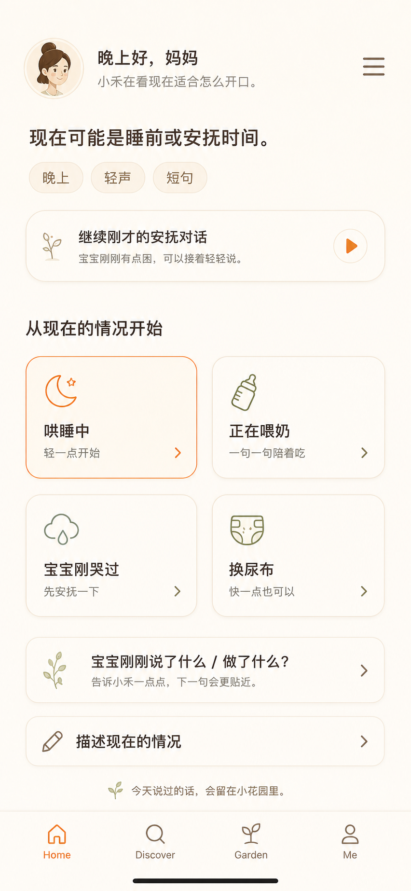

# 06_Home_Screen

## 状态

Home V4 已批准设计规格。本文档是产品与交互设计规格，不是实现指南。

V4 替代 V3。V3 的 `一个主短句 + 两个备选短句` 模型已经失效。

参考来源：
- `DESIGN.md`
- `docs/PRODUCT_COPILOT.md`
- `docs/design-spec/README.md`
- Baby Talk 2 Final Design Brief
- Home V4 已批准原型图

已批准原型图：



历史参考：
- `docs/design-spec/assets/home-v3-moment-entry.png`

说明：
- 历史 Home V3 原型只用于理解旧问题。
- 实现必须以本文档和 Home V4 原型为准。

## 1. 页面目标

Home 是当前时刻的对话入口页。

家长打开 Home 后，3 秒内应该知道：
1. App 认为现在大概是什么照护时刻；
2. 哪个可见入口可以马上开始一段亲子英语对话；
3. 是否可以继续刚才未结束的对话；
4. 如果当前情况特殊，如何告诉小禾。

Home 不是：
- 固定短语页；
- 课程页；
- checklist；
- flashcard 页；
- 内容流；
- AI prompt 页面。

Home 不展示英语短语卡。英语短语只在进入 Practice 后出现。

## 2. 用户进入场景

用户进入 Home 的条件：
- onboarding 已完成；
- App 启动后进入首页；
- 用户从 Practice 返回；
- 用户点击底部导航 Home；
- 用户在照护场景中从后台恢复 App。

Home 接收或推导这些值：
- `timeBand`：`morning`、`noon`、`afternoon`、`evening`、`night` 之一。
- `parentDisplayName`：可为空。为空时本轮原型使用 `妈妈`。
- `babyNickname`：可为空。为空时使用 `宝宝`。
- `babyAgeMonths`：可为空。为空时不提年龄。
- `recentSceneKeys`：最近 7 天最多 10 个场景 key。
- `recentSpokenPhraseIds`：最多 20 个最近说过的 phrase ID。
- `activeConversation`：可为空的进行中对话摘要。
- `networkState`：`online`、`slow`、`offline` 之一。

`activeConversation` 只有同时满足以下条件时有效：
- `activeConversation.status = open`；
- `activeConversation.updatedAt` 距现在不超过 30 分钟；
- 用户没有在 Practice 中点击 `今天先到这里`。

如果进行中对话超过 30 分钟，Home 不显示继续入口。

## 3. 用户心理状态

假设用户此刻：
- 可能一只手抱着宝宝；
- 可能疲惫、被打断、没有耐心配置；
- 想马上知道可以怎么开口；
- 当前场景可能很快变化；
- 不想先学习英语知识；
- 不想接受发音评分。

Home 必须回应：
- 4 个直接开始的照护对话入口；
- 30 分钟内有效时显示一个继续入口；
- 一个宝宝信号入口；
- 一个自由描述当前情况入口；
- 不评分、不录音、不测试、不打卡。

## 4. 页面内容优先级

P0：
- 问候与小禾身份；
- 当前时刻判断；
- 有效时显示继续入口；
- 4 个直接开始的照护对话入口；
- 底部导航。

P1：
- 宝宝信号入口；
- 自定义当前情况入口；
- 入口推荐降级状态。

P2：
- 花园轻回响；
- 菜单入口。

P3：
- 完整短语浏览；
- 花园数据分析；
- 长对话小禾聊天；
- 资料编辑。

## 5. 产品模型

Home 使用“情境入口模型”，不使用“短语组模型”。

### 5.1 对话入口

对话入口是一个可点击入口。点击后进入 Practice，并携带照护上下文。

Home 默认状态固定展示 4 个直接开始入口。

夜间默认入口顺序：
1. `哄睡中`
2. `正在喂奶`
3. `宝宝刚哭过`
4. `换尿布`

如果后端返回入口推荐，后端可以替换默认标签和顺序，但前端仍只显示 4 个入口。

入口数据契约：

```json
{
  "routeId": "bedtime_soothing",
  "sceneType": "bedtime",
  "displayName": "哄睡中",
  "subtitle": "轻一点开始",
  "iconKey": "moon",
  "isRecommended": true,
  "entryReason": "evening_time_and_recent_bedtime",
  "initialTone": "short_gentle",
  "maxFirstPhraseWords": 7
}
```

字段规则：
- `displayName`：2-5 个中文字符。
- `subtitle`：4-9 个中文字符。
- `iconKey`：必须映射到本文档批准的 Flutter 图标或资产 ID。
- `isRecommended`：4 个可见入口中最多 1 个为 `true`。
- `entryReason`：不在 Home 展示。
- `maxFirstPhraseWords`：3-8 的整数。

### 5.2 进入 Practice 的 payload

用户点击入口时，Home 发送：

```json
{
  "entrySource": "home_route",
  "routeId": "bedtime_soothing",
  "sceneType": "bedtime",
  "babySignal": null,
  "customSituationText": null,
  "resumeConversationId": null,
  "timeBand": "evening",
  "babyNickname": "宝宝",
  "babyAgeMonths": null,
  "parentTonePreference": "short_gentle",
  "recentSpokenPhraseIds": []
}
```

Practice 在导航后请求第一句英语。Home 不等待短语生成。

### 5.3 继续入口

继续入口只在 `activeConversation` 有效时显示，位置在入口区上方。

固定文案：
- 标题：`继续刚才的安抚对话`
- 副文案：`宝宝刚刚有点困，可以接着轻轻说。`

点击后发送：

```json
{
  "entrySource": "home_continue",
  "resumeConversationId": "active_conversation_id",
  "routeId": "previous_route_id",
  "sceneType": "previous_scene_type"
}
```

Practice 使用已有上下文请求下一句。

### 5.4 宝宝信号入口

宝宝信号入口用于在开始前告诉小禾宝宝刚刚的行为。

固定文案：
- 标题：`宝宝刚刚说了什么 / 做了什么？`
- 副文案：`告诉小禾一点点，下一句会更贴近。`

点击后打开 BabySignalSheet。

### 5.5 自定义当前情况入口

自定义当前情况入口用于处理 4 个入口以外的特殊情况。

固定文案：
- 标题：`描述现在的情况`

点击后打开 CurrentSituationSheet。提交后进入 Practice，`entrySource = home_custom_situation`。

### 5.6 AI 可见性规则

UI 必须隐藏后端 LLM 机制。

允许文案：
- `小禾在看现在适合怎么开口。`
- `小禾正在换成更贴近现在的话。`
- `告诉小禾一点点，下一句会更贴近。`

禁止文案：
- `AI生成`
- `LLM`
- `prompt`
- `模型`
- `置信度`
- `重新生成`
- `生成失败`

## 6. 用户操作流程

1. 打开 Home
   - 立即展示缓存或本地入口。
   - 后端入口推荐返回后，可用 240ms 淡入淡出原地更新。
   - 等待期间不能清空页面。

2. 继续最近对话
   - 用户点击 `继续刚才的安抚对话`。
   - App 立即进入 Practice。
   - Practice 显示上一轮状态，或用温柔加载态请求下一句。

3. 从可见入口开始
   - 用户点击 4 个入口之一。
   - App 立即进入 Practice。
   - Practice 使用入口 payload 请求第一句。

4. 从宝宝信号开始
   - 用户点击 `宝宝刚刚说了什么 / 做了什么？`。
   - BabySignalSheet 打开。
   - 用户选择信号或输入短文本。
   - 点击 `用这个开始` 后进入 Practice。

5. 从自定义情况开始
   - 用户点击 `描述现在的情况`。
   - CurrentSituationSheet 打开。
   - 用户输入 2-40 个中文字符，或选择一个快捷情况。
   - 点击 `这样开始` 后进入 Practice。

6. 从 Practice 返回
   - 如果 Practice 仍为 open，Home 显示继续入口。
   - 如果用户在 Practice 点击了 `今天先到这里`，Home 不显示继续入口。
   - Home 可更新花园轻回响文案。

## 7. 原型屏幕状态与跳转说明

### Screen 1：默认 Home / 有继续入口

这是已批准 Home V4 原型状态。

可见状态：
- 顶部头像或 initials 圆形；
- 问候：`晚上好，妈妈`；
- 副文案：`小禾在看现在适合怎么开口。`；
- 右上角菜单图标；
- 当前判断：`现在可能是睡前或安抚时间。`；
- 3 个 context pill：`晚上`、`轻声`、`短句`；
- 继续入口：`继续刚才的安抚对话`；
- 区块标题：`从现在的情况开始`；
- 4 个直接入口：
  - `哄睡中` / `轻一点开始`
  - `正在喂奶` / `一句一句陪着吃`
  - `宝宝刚哭过` / `先安抚一下`
  - `换尿布` / `快一点也可以`
- 宝宝信号入口；
- 自定义当前情况入口；
- 花园轻回响：`今天说过的话，会留在小花园里。`；
- 底部导航：Home、Discover、Garden、Me。

进入条件：
- 用户在晚上或夜间打开 Home；
- 有 30 分钟内更新过的 open 对话；
- 后端入口推荐可用，或本地默认入口已加载；
- 没有 modal 打开。

用户可操作：
- 点击菜单图标：打开资料/设置抽屉。
- 点击继续入口：进入 Practice 继续状态。
- 点击任意入口：进入 Practice 第一轮。
- 点击宝宝信号入口：进入 Screen 4。
- 点击自定义当前情况入口：进入 Screen 5。
- 点击底部导航 Discover/Garden/Me：进入对应 tab。

跳转：
- Screen 1 -> Practice Resume：点击继续入口。
- Screen 1 -> Practice First Turn：点击任意入口。
- Screen 1 -> Screen 4：点击宝宝信号入口。
- Screen 1 -> Screen 5：点击自定义当前情况入口。
- Screen 1 -> Drawer：点击菜单。
- Screen 1 -> 其他 tab：点击底部导航。

### Screen 2：默认 Home / 无继续入口

可见状态：
- 和 Screen 1 相同，但不显示继续入口。
- route 区块在 context pills 下方 24px 处开始。

进入条件：
- 没有有效 open 对话；
- 或上一轮对话超过 30 分钟；
- 或用户在 Practice 点击了 `今天先到这里`。

用户可操作：
- 与 Screen 1 相同，但没有继续入口。

跳转：
- Screen 2 -> Practice First Turn：点击任意入口。
- Screen 2 -> Screen 4：点击宝宝信号入口。
- Screen 2 -> Screen 5：点击自定义当前情况入口。

### Screen 3：入口推荐刷新中

可见状态：
- 现有 Home 内容保持可见；
- 入口标签保持当前值；
- 当前判断下方显示小字：`小禾正在换成更贴近现在的入口。`
- 不显示全屏 spinner；
- 不禁用页面。

进入条件：
- App 打开或恢复时正在请求后端入口推荐；
- 缓存或本地入口已经可见。

用户可操作：
- 点击任意入口：立即用当前入口进入 Practice。
- 等待：后端返回后入口原地更新。
- 切换 tab：请求继续在后台执行，结果可缓存。

跳转：
- Screen 3 -> Screen 1 或 Screen 2：后端结果返回。
- Screen 3 -> Screen 6：4 秒未返回。
- Screen 3 -> Practice First Turn：用户点击入口。

### Screen 4：BabySignalSheet

可见状态：
- Home 背景使用暖色遮罩；
- 底部抽屉标题：`宝宝刚刚怎么样？`
- 辅助文案：`选一个最接近的就好，也可以不选。`
- 信号选项：
  - `哭了`
  - `笑了`
  - `指东西`
  - `说了一个词`
  - `没有明显反应`
- 可选输入框：`也可以写一句现在的反应`
- 主操作：`用这个开始`
- 次操作：`先回首页`

进入条件：
- 用户在 Screen 1 或 Screen 2 点击宝宝信号入口。

用户可操作：
- 点击一个选项：选中该选项；再点其他选项会替换。
- 输入文本：保存 `babySignalText`，最多 40 个中文字符。
- 点击 `用这个开始`：带信号进入 Practice。
- 点击 `先回首页`：关闭抽屉。
- 下滑或点击遮罩：关闭抽屉。

校验：
- 即使没有选择、没有输入，`用这个开始` 也可点击。
- 无选择、无输入时，payload 使用 `babySignal = "unspecified"`。

跳转：
- Screen 4 -> Practice First Turn：点击 `用这个开始`。
- Screen 4 -> Screen 1 或 Screen 2：关闭抽屉。

### Screen 5：CurrentSituationSheet

可见状态：
- Home 背景使用暖色遮罩；
- 底部抽屉标题：`现在是什么情况？`
- 辅助文案：`写一句中文就可以，小禾会接住这个场景。`
- 输入框 placeholder：`比如：宝宝刚洗完澡，还不想睡`
- 快捷选项：
  - `不肯睡`
  - `要喝水`
  - `吃饭闹`
  - `要出门`
  - `刚洗完澡`
  - `想继续玩`
- 主操作：`这样开始`
- 次操作：`先回首页`

进入条件：
- 用户点击 `描述现在的情况`。

用户可操作：
- 点击快捷选项：选中该情况。
- 输入文字：保存 custom situation，最多 40 个中文字符。
- 点击 `这样开始`：带当前情况进入 Practice。
- 点击 `先回首页`：关闭抽屉。
- 下滑或点击遮罩：关闭抽屉。

校验：
- 选中一个快捷选项，或输入至少 2 个中文字符后，`这样开始` 才可点击。

跳转：
- Screen 5 -> Practice First Turn：点击 `这样开始`。
- Screen 5 -> Screen 1 或 Screen 2：关闭抽屉。

### Screen 6：离线或慢网络入口降级

可见状态：
- Home 保持可用；
- 当前判断使用本地推断；
- 入口使用当前 timeBand 的本地默认值；
- 当前判断下方小字：
  - 离线：`现在没联网，先用这几个常用入口。`
  - 慢网络：`先用这几个入口，小禾稍后再换得更贴近。`

进入条件：
- `networkState = offline`；
- 或后端入口推荐 4 秒内未返回。

用户可操作：
- 点击任意入口：用本地入口 payload 进入 Practice。
- 点击宝宝信号或自定义当前情况：打开同样的底部抽屉。

跳转：
- Screen 6 -> Practice First Turn：点击入口或提交抽屉。
- Screen 6 -> Screen 1 或 Screen 2：后端稍后返回且 Home 仍可见。

## 8. 组件清单

- HomeTopBar
- CurrentContextStatement
- ContextPillRow
- ContinueConversationStrip
- ConversationRouteGrid
- ConversationRouteTile
- BabySignalEntry
- CurrentSituationEntry
- BabySignalSheet
- CurrentSituationSheet
- HomeGardenWhisper
- BottomNavigation

## 9. 组件细节

### HomeTopBar

用途：
- 让用户感觉小禾在场，但 Home 不像聊天机器人页面。

内容：
- 头像或 initials 圆形；
- 问候；
- 副文案；
- 菜单图标。

规则：
- 问候最多 8 个中文字符。
- 副文案最多 16 个中文字符。
- 家长姓名未知时使用 `妈妈`。
- 小禾头像资产缺失时使用 initials 圆形 `小禾`。

### CurrentContextStatement

用途：
- 告诉家长 App 当前假设的照护时刻。

夜间默认文案：
- `现在可能是睡前或安抚时间。`

规则：
- 主句不超过 16 个中文字符。
- 禁止使用 `识别到`、`检测到`、`置信度`。
- 置信度低时使用：`现在可能适合先轻轻说几句。`

### ContextPillRow

用途：
- 用轻量信号解释当前推荐。

规则：
- 固定显示 3 个 pill。
- 每个 pill 为 2-4 个中文字符。
- 夜间默认：`晚上`、`轻声`、`短句`。
- pill 不是筛选器，不打开菜单。

### ContinueConversationStrip

用途：
- 继续最近未结束的照护对话。

规则：
- 最多显示 1 个继续入口。
- 仅在 active conversation 有效时显示。
- 高度 72-88px。
- 整个条目可点击。
- 右侧图标使用暖棕或植物绿，不使用播放器进度条、暂停、下一首或歌单控件。

### ConversationRouteGrid

用途：
- 提供多个直接开始的照护情境，减少“系统猜错后还要纠错”的成本。

规则：
- 首屏固定可见 4 个入口。
- 2 列 x 2 行。
- 单个入口高度 108-124px。
- 间距 12-16px。
- 不是三列图标网格。
- 每个入口点击后直接进入 Practice。

### ConversationRouteTile

用途：
- 启动一个照护对话入口。

内容：
- 线性图标；
- 入口标题；
- 入口副标题；
- 小箭头。

规则：
- 不显示英语短语。
- 不在 tile 内放大 CTA 按钮。
- 整个 tile 是点击区域。
- 最多 1 个推荐入口使用橙色边框和橙色图标。
- 非推荐入口使用暖色边框和暖棕/植物图标。
- 标题最多 5 个中文字符。
- 副标题最多 9 个中文字符。

### BabySignalEntry

用途：
- 让下一句能响应宝宝行为。

规则：
- 位于入口区下方，整行可点击。
- 打开 BabySignalSheet。
- 不录音。
- 不要求发音。
- 不暗示“没有反应”是不好的。

### CurrentSituationEntry

用途：
- 处理 4 个入口之外的特殊情况。

规则：
- 位于 BabySignalEntry 下方。
- 打开 CurrentSituationSheet。
- 标题固定为 `描述现在的情况`。
- 禁止使用 `prompt`、`生成`、`问 AI`。

### HomeGardenWhisper

用途：
- 把说过的话和花园建立轻连接，但不把 Home 变成 Garden。

规则：
- 只显示一行。
- 默认文案：`今天说过的话，会留在小花园里。`
- 不显示统计。
- 不显示进度条。
- 不使用奖励语言。

## 10. 空状态

没有宝宝昵称：
- 使用 `宝宝`。
- 不伪造 `小明` 等名字。
- 不阻塞 Home。

没有家长姓名：
- 使用 `妈妈`。

没有历史：
- 使用 timeBand 本地默认入口。
- 隐藏继续入口。

没有后端入口推荐：
- 使用本地默认入口。
- 保持所有入口可点击。

没有小禾头像资产：
- 使用 initials 圆形 `小禾`。

## 11. 错误与降级状态

后端入口推荐不可用：
- 保留本地入口。
- 文案：`先用这几个入口，小禾稍后再换得更贴近。`
- 不显示 `推荐失败`。

网络离线：
- 文案：`现在没联网，先用这几个常用入口。`
- 入口仍可进入 Practice，由 Practice 使用本地 fallback 短语。

Practice 第一句生成失败：
- 由 Practice 处理，不在 Home 显示短语生成错误。

音频不可用：
- Home 不处理，因为 Home 不展示短语音频。
- Practice 短语屏处理。

场景置信度低：
- 保持 4 个入口可见。
- 当前判断改为：`现在可能适合先轻轻说几句。`
- 不自动打开 bottom sheet。

## 12. 视觉与动效要求

布局：
- 目标视口：竖屏手机，最大宽度 430px。
- 页面左右 padding：原型为 24px，实现可按设备宽度使用 20-24px。
- 顶部内容不超过屏幕高度的 34%。
- 390x844 屏幕上，4 个入口必须无需滚动即可看见。
- 底部导航固定。

颜色：
- 背景使用暖奶油纸色。
- Home 上橙色最多出现 2 处：
  1. 当前 Home 底部导航 icon/text；
  2. 推荐入口边框/图标。
- 如果推荐入口和 active nav 已用橙色，继续入口图标不能再用橙色。
- Home 不使用青绿色英语短语色，因为 Home 不展示英语短语。

字体：
- Home 上没有任何文字可以大过当前判断文案。
- 入口标题 20-22px，中等字重。
- 入口副标题 14-15px，常规字重。
- Home 不出现英语短语 hero。

图片与视觉锚点：
- Home 可以使用图标级图片帮助识别照护情境，但图片只能服务于快速识别，不承担内容浏览。
- 4 个照护入口允许使用 28-36px 的线性情境图标或小插画，例如月亮、奶瓶、眼泪水滴、尿布篮。
- 继续入口允许使用 24-36px 的小植物、夜灯或当前场景缩略图。
- HomeTopBar 允许显示小禾头像，尺寸 48px。
- Home 不显示大封面图、横向图片 shelf、真实宝宝照片、大面积插画 hero、背景装饰图或每个入口的复杂图片。
- Home 和 Discover 的图片边界：Home 使用图标级视觉锚点；Discover 可以使用缩略图级情境封面帮助浏览。
- 入口图片最大尺寸 36px，不能超过入口卡片高度的 28%。
- 图片缺失时使用本文档第 15 节指定 Flutter IconData fallback，不能从原型 PNG 裁切。

动效：
- 入口点击反馈：120ms，scale 1.00 -> 0.98 -> 1.00。
- 入口推荐更新：240ms 淡入淡出。
- 底部抽屉打开：320ms。
- 底部抽屉关闭：240ms。
- Home 不出现庆祝动画。

## 13. 数据契约与后端 / Practice 契约

Home 不请求、不展示短语卡。

Home 可以请求入口推荐：

```json
{
  "timeBand": "evening",
  "babyNickname": "宝宝",
  "babyAgeMonths": null,
  "recentSceneKeys": ["bedtime", "feeding"],
  "recentSpokenPhraseIds": ["p_001", "p_002"],
  "activeConversationSummary": {
    "sceneType": "soothing",
    "lastBabySignal": "sleepy"
  }
}
```

后端返回：

```json
{
  "contextStatement": "现在可能是睡前或安抚时间。",
  "contextPills": ["晚上", "轻声", "短句"],
  "routes": [
    {
      "routeId": "bedtime_soothing",
      "sceneType": "bedtime",
      "displayName": "哄睡中",
      "subtitle": "轻一点开始",
      "iconKey": "moon",
      "isRecommended": true,
      "entryReason": "evening_time_and_recent_bedtime",
      "initialTone": "short_gentle",
      "maxFirstPhraseWords": 7
    }
  ]
}
```

前端归一化：
- 后端返回超过 4 个入口时，只取前 4 个。
- 后端返回少于 4 个入口时，用本地默认入口补齐。
- 后端返回 0 个入口时，全部使用本地默认入口。
- 后端返回多个 `isRecommended = true` 时，只保留第一个可见推荐入口。

Practice 负责：
- 第一条短语生成；
- 标准发音音频；
- `我说了`；
- 可选宝宝反应；
- 每一句下一句的上下文生成。

## 14. AI 生成与设计检查要求

生成或 review Home 图时必须满足：
- 不展示英语短语卡；
- 不展示固定 3 句短语组；
- 不显示 `说这一句` 按钮；
- 不显示麦克风；
- 不显示录音波形；
- 不显示发音评分；
- 不显示 checklist；
- 不显示积分、连续天数或任务完成；
- 显示 4 个可见照护入口；
- 入口可以有 28-36px 情境视觉锚点，但不能出现大封面图或图片书架；
- 显示宝宝信号入口；
- 显示自定义当前情况入口；
- 风格与 onboarding V3 和 Home V4 已批准原型一致。

## 15. 图标与视觉资产清单

原型 PNG 参考：
- `docs/design-spec/assets/home-v4-context-launcher.png`

PNG 只作为视觉参考。禁止从 PNG 裁切图标、头像或植物线稿。

| Asset ID | 用途 | 类型 | 本地路径或实现来源 | 尺寸 | 颜色规则 | 状态 | 必须处理方式 |
|----------|------|------|-------------------|------|----------|------|--------------|
| icon.menu | 右上角菜单 | Flutter IconData | `Icons.menu_rounded` | 28px | `--text-secondary` | available | 打开 drawer。 |
| icon.route.moon | `哄睡中` 入口 | Flutter IconData | `Icons.nightlight_round` | 30px | 推荐入口用 `--accent-dark`，否则用 `--text-secondary` | available | 不用 emoji 月亮。 |
| icon.route.bottle | `正在喂奶` 入口 | Flutter IconData | `Icons.local_drink_outlined` | 30px | `--text-secondary` | available | 之后如有批准 SVG 再替换。 |
| icon.route.soothing | `宝宝刚哭过` 入口 | Flutter IconData | `Icons.water_drop_outlined` | 30px | `--text-secondary` | available | 表达哭过/眼泪，不使用夸张哭脸。 |
| icon.route.diaper | `换尿布` 入口 | Flutter IconData | `Icons.checkroom_outlined` | 30px | `--text-secondary` | available | 临时近似；见资产缺口 backlog。 |
| icon.arrow.forward | 入口和行尾箭头 | Flutter IconData | `Icons.chevron_right_rounded` | 24px | route color 或 `--text-secondary` | available | 保持小，不做填充按钮。 |
| icon.continue | 继续入口动作 | Flutter IconData | `Icons.play_arrow_rounded` | 24px inside 44px circle | 植物绿或暖棕；当 nav 和推荐入口已用橙色时不能用橙色 | available | 不显示暂停/下一首/进度条。 |
| icon.signal | 宝宝信号入口 | Flutter IconData | `Icons.eco_outlined` | 28px | `--success` 75% opacity | available | 直到有批准植物资产。 |
| icon.custom_situation | 当前情况入口 | Flutter IconData | `Icons.edit_outlined` | 28px | `--text-secondary` | available | 打开 CurrentSituationSheet。 |
| illustration.route.bedtime.anchor | `哄睡中` 入口视觉锚点 | SVG | `mobile/assets/illustrations/route_bedtime_anchor.svg` | 28-36px | `currentColor`，推荐入口可用 `--accent-dark` | missing | 未补前使用 `Icons.nightlight_round`。 |
| illustration.route.feeding.anchor | `正在喂奶` 入口视觉锚点 | SVG | `mobile/assets/illustrations/route_feeding_anchor.svg` | 28-36px | `currentColor`，默认 `--text-secondary` | missing | 未补前使用 `Icons.local_drink_outlined`。 |
| illustration.route.soothing.anchor | `宝宝刚哭过` 入口视觉锚点 | SVG | `mobile/assets/illustrations/route_soothing_anchor.svg` | 28-36px | `currentColor`，默认 `--text-secondary` | missing | 未补前使用 `Icons.water_drop_outlined`。 |
| illustration.route.diaper.anchor | `换尿布` 入口视觉锚点 | SVG | `mobile/assets/illustrations/route_diaper_anchor.svg` | 28-36px | `currentColor`，默认 `--text-secondary` | missing | 未补前使用 `Icons.checkroom_outlined`。 |
| icon.nav.home | 底部导航 Home | Flutter IconData | `Icons.home_outlined` / selected `Icons.home_rounded` | 24px | selected `--accent-dark`，unselected `--text-muted` | available | 不使用填充 tab 背景，不显示 badge。 |
| icon.nav.discover | 底部导航 Discover | Flutter IconData | `Icons.search_rounded` | 24px | unselected `--text-muted` | available | label 为 `Discover`。 |
| icon.nav.garden | 底部导航 Garden | Flutter IconData | `Icons.local_florist_outlined` | 24px | unselected `--text-muted` | available | label 为 `Garden`。 |
| icon.nav.me | 底部导航 Me | Flutter IconData | `Icons.person_outline_rounded` | 24px | unselected `--text-muted` | available | label 为 `Me`。 |
| illustration.xiaohe.avatar | HomeTopBar 小禾头像 | SVG 或 PNG | `mobile/assets/illustrations/xiaohe_teacher_avatar.svg` | 48px | full color, no pure black | missing | 缺失时使用 initials 圆形 `小禾`。 |
| illustration.garden.sprout.tiny | HomeGardenWhisper 嫩芽 | SVG | `mobile/assets/illustrations/garden_sprout_tiny.svg` | 18px | `--success` stroke | missing | 缺失时使用 `Icons.eco_outlined` 或隐藏图标；禁止 emoji。 |

## 16. 实现偏差风险

| 风险 | 影响 | 必须修正 |
|------|------|----------|
| 继续保留 Home V3 短语卡。 | Home 会退回一句话推荐页。 | Home 实现中移除 `PrimaryPhraseStone`、`BackupPhraseStone`、`PronunciationControl` 和 `说这一句`。 |
| Home 在导航前请求短语组。 | Home 会等待 LLM，启动变慢。 | Home 只请求入口推荐；Practice 请求短语生成。 |
| 4 个入口被实现成通用图标宫格。 | 产品会像儿童 App 或设置页。 | 使用纸感情境入口：标题、副标题、箭头；禁止三列图标网格。 |
| Bottom sheet 变成主要场景选择路径。 | 常见场景多一步操作，照护场景成本过高。 | Home 固定显示 4 个直接入口；bottom sheet 只处理宝宝信号和自定义情况。 |
| 从生成图里复制或未经批准地近似小禾头像。 | 小禾可能变儿童化。 | 资产未批准前使用 initials 圆形 `小禾`。 |
| 多个入口图标、继续按钮和 nav 都使用橙色。 | 违反克制强调色规则。 | 橙色只用于 active nav 和 1 个推荐入口。继续入口使用暖棕或植物绿。 |
| Home 显示 `AI生成`、`重新生成` 或 prompt 语言。 | 产品像 AI 工具，不像家长陪伴。 | 只使用 5.6 中的小禾文案。 |
| Home 在没有昵称时显示具体宝宝名。 | 个性化不诚实。 | `babyNickname = null` 时使用 `宝宝`。 |
| 用户已结束 Practice 后仍显示继续入口。 | 用户会感觉被催促继续。 | 点击 `今天先到这里` 后隐藏继续入口；超过 30 分钟也隐藏。 |
| 后端入口数量不固定导致布局变化。 | 首屏可能拥挤或出现滚动。 | 前端归一化为固定 4 个可见入口。 |
| Home 加入 Discover 式大图片 shelf。 | Home 会从“马上开始”变成浏览内容页。 | Home 只允许 28-36px 情境视觉锚点；大图和横向图片 shelf 只能出现在 Discover。 |
| Home 使用真实宝宝照片。 | 会像育儿内容流，也有隐私和情绪误读风险。 | 禁止真实宝宝照片；使用线性小插画或 Flutter IconData fallback。 |
| Home 入口小插画缺失时临时手画 SVG。 | 风格会偏离 Warm Paper Kindness。 | 使用第 15 节 Flutter IconData fallback，等统一资产补齐。 |

## 17. 文案规则与禁用清单

Home 文案目标：
- 让家长知道现在可以从哪个照护情境开始；
- 不展示英语短句；
- 不暴露 AI/LLM 机制；
- 不把入口说成任务或课程。

固定允许文案：
- `晚上好，妈妈`
- `小禾在看现在适合怎么开口。`
- `现在可能是睡前或安抚时间。`
- `继续刚才的安抚对话`
- `从现在的情况开始`
- `宝宝刚刚说了什么 / 做了什么？`
- `告诉小禾一点点，下一句会更贴近。`
- `描述现在的情况`
- `今天说过的话，会留在小花园里。`

资料为空时：
- `parentDisplayName = null`：使用 `妈妈`。
- `babyNickname = null`：使用 `宝宝`。
- `babyAgeMonths = null`：不显示年龄，不自行推断月龄。

禁止出现：
- `AI生成`
- `LLM`
- `prompt`
- `模型`
- `置信度`
- `重新生成`
- `生成失败`
- `推荐失败`
- `开始练习`
- `完成任务`
- `打卡`
- `积分`
- `连续天数`
- `说这一句`

Home 不出现这些控件文案：
- `听标准发音`
- `我说了`
- `宝宝刚刚怎样？`

这些控件属于 Practice。

## 18. 与其他页面的关系

Practice：
- Home 点击任何照护入口后进入 Practice。
- Home 只传上下文 payload，不传固定短语组。
- Practice 请求首句、播放发音、处理 `我说了`、宝宝信号和下一句。
- Practice 点击 `今天先到这里` 后，Home 不再显示该会话的继续入口。

Onboarding：
- Onboarding 完成后进入 Home。
- Onboarding 和 Home 使用同一套 4 个照护情境入口模型。
- Home 不恢复 Onboarding 的固定短语组，因为 Onboarding V4 已废弃固定短语组。

Garden：
- Home 只显示一行花园轻回响。
- 花园数据、花朵阶段、成长记录不在 Home 展开。

Discover：
- Discover 负责浏览场景和短语库。
- Home 不承担搜索、收藏、筛选功能。

Me：
- Me 负责资料、设置、宝宝信息。
- Home 在资料为空时使用默认称呼，不强迫进入资料编辑。

小禾：
- Home 只显示小禾的当前时刻提示。
- 长聊天、解释原因、复杂建议放到小禾页面或小禾底部面板。

## 19. 验收标准

实现完成后必须满足：

1. Home 首屏不展示英语短句卡。
2. Home 首屏不展示 `听标准发音`、`我说了` 或 `说这一句`。
3. Home 默认显示 4 个直接开始的照护入口。
4. 有 30 分钟内有效 open 对话时显示 1 个继续入口。
5. 用户点击 `今天先到这里` 结束 Practice 后，Home 不再显示该继续入口。
6. 点击任意照护入口后立即进入 Practice，Home 不等待短语生成。
7. 后端返回超过 4 个入口时，前端只显示前 4 个。
8. 后端返回少于 4 个入口时，前端用本地默认入口补齐到 4 个。
9. 离线时仍显示本地默认入口，并可进入 Practice。
10. `babyNickname = null` 时 Home 使用 `宝宝`，不显示伪造昵称。
11. Home 不出现 `AI生成`、`prompt`、`重新生成`、`推荐失败`。
12. 原型中的小禾头像和植物线稿未补资产前，使用文档指定 fallback，不从 PNG 裁切。
