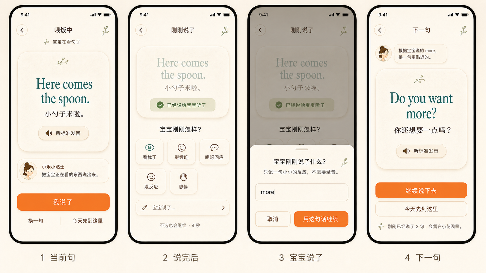

# 07_Practice_Screen

## 状态

Practice V2 设计规格。本文档是产品与交互设计规格，不是实现指南。

V2 使用“共同注意力回合台”模型，替代旧的固定短语组、步骤进度和 flashcard 模型。

参考来源：
- `DESIGN.md`
- `docs/PRODUCT_COPILOT.md`
- `docs/design-spec/README.md`
- `docs/design-spec/06_Home_Screen.md`
- `docs/design-spec/12_Onboarding_Screen.md`
- Baby Talk 2 Final Design Brief
- `docs/refs/Captivate! Contextual Language Guidance for Parent–Child Interaction.pdf`
- Practice V2 新生成原型图

当前原型图：



说明：
- 原型图用于表达核心状态、层级和视觉方向。
- 原型图里的头像、植物线稿、图标只作为视觉参考，不能从 PNG 裁切使用。
- 本文档中的状态、跳转、数据契约和禁用规则优先级高于原型图。
- 原型图第 2 屏的宝宝信号视觉在实现时必须改为轻量 chip 条，不能实现成图标宫格。

## 1. 页面目标

Practice 是家长在真实照护时刻里逐句开口的页面。

Practice 必须让家长完成这个循环：

1. 看见一句适合当前照护情境的英文。
2. 可以先听标准英语发音。
3. 对宝宝说出这句。
4. 点 `我说了`。
5. 可选告诉小禾宝宝刚刚的反应。
6. 收到根据上下文生成的下一句。
7. 可以一直说下去，也可以温柔结束。

Practice 不是：
- 固定 3 句短语组；
- 课程页；
- flashcard 页；
- 发音测试页；
- 录音页；
- AI prompt 页面；
- 任务完成页。

Practice 不显示 `1/3`、`2 of 4`、进度百分比、正确率、分数、发音评分、连续打卡或排行榜。

## 2. 用户进入场景

用户进入 Practice 的入口：
- Home 点击 4 个照护入口之一；
- Home 点击 30 分钟内有效的继续入口；
- Home 的 BabySignalSheet 提交宝宝信号；
- Home 的 CurrentSituationSheet 提交自定义情况；
- Onboarding 首次情境入口；
- Onboarding 下一句出现后点击 `继续说下去`；
- Discover 中未来的场景入口。

Practice 接收这些值：
- `entrySource`：`home_route`、`home_continue`、`home_signal`、`home_custom_situation`、`onboarding_route`、`discover_route` 之一。
- `routeId`：照护入口 ID。
- `sceneType`：`feeding`、`bedtime`、`diaper`、`bath`、`crying`、`play`、`outdoor`、`custom` 之一。
- `babySignal`：可为空。
- `babySignalText`：可为空。
- `customSituationText`：可为空。
- `resumeConversationId`：可为空。
- `timeBand`：`morning`、`noon`、`afternoon`、`evening`、`night` 之一。
- `babyNickname`：可为空。为空时显示 `宝宝`。
- `babyAgeMonths`：可为空。为空时不显示年龄。
- `parentTonePreference`：默认 `short_gentle`。
- `recentSpokenPhraseIds`：最近说过的 phrase ID 列表。
- `onboardingMode`：布尔值，默认 `false`。

Practice 进入后立即请求第一句或下一句。入口页不预先持有固定短语组。

## 3. 用户心理状态

假设用户此刻：
- 可能一只手抱着宝宝；
- 可能正在喂饭、哄睡、换尿布或洗澡后擦身；
- 不能长时间盯屏；
- 想知道现在该怎么说；
- 担心发音不标准；
- 不想被录音、评分或纠错；
- 可能只说一句，也可能想一直说下去。

Practice 必须回应：
- 每轮只有一个主动作；
- 句子短、可读、可听；
- `我说了` 后才出现宝宝反应；
- 宝宝反应不必填；
- 宝宝说话反馈使用轻文本入口；
- 不出现麦克风；
- 不出现“没听清”“识别失败”“请重说”。

## 4. 页面内容优先级

P0：
- 当前照护上下文；
- 当前英文短句；
- 中文意思；
- 标准发音按钮；
- `我说了`；
- `我说了` 后出现的宝宝信号；
- 下一句生成和继续。

P1：
- 小禾一句照护提示；
- `换一句`；
- `今天先到这里`；
- 刚刚说过的句数叙事。

P2：
- 花园痕迹提示；
- 离线或网络慢的温柔降级；
- Onboarding 模式下的首次体验提示。

P3：
- 长列表历史；
- 完整成长数据；
- 复杂自定义 prompt；
- 发音教学。

## 5. 产品模型

Practice 使用“共同注意力回合台”模型。

一个回合由 4 个事件组成：

```text
当前句 ready
→ 家长点 我说了
→ 可选宝宝信号 / 宝宝说了轻文本
→ 请求下一句
```

回合可以无限继续。系统不得要求用户完成固定句数。

### 5.1 当前句

当前句是页面最大视觉元素。

当前句必须包含：
- `englishText`
- `zhTranslation`
- `audioUrl`
- `xiaoheTip`
- `contextLabel`

英文句长度规则：
- 默认 3-8 个英文单词。
- `bedtime` 和 `crying` 场景默认不超过 7 个英文单词。
- `babyAgeMonths` 小于 18 时默认不超过 6 个英文单词。
- 如果后端返回超过 12 个英文单词，前端仍展示，但字体从 32px 降到 28px，最多 3 行。

中文翻译长度规则：
- 默认 6-18 个中文字符。
- 最多 2 行。
- 超过 2 行时保留完整语义，允许字号从 15px 降到 14px。

### 5.2 标准发音

发音入口只用于播放标准英语。

按钮文案固定：
- `听标准发音`

图标规则：
- 使用扬声器或播放图标。
- 禁止使用麦克风、录音圆点、波形、声纹、打分仪表。

播放行为：
- 点击后立即播放 `audioUrl`。
- 播放中按钮文案改为 `正在播放`。
- 播放结束后恢复 `听标准发音`。
- 播放失败时文案为 `这次没放出来，可以直接说。`
- 播放失败不阻止 `我说了`。

### 5.3 我说了

`我说了` 是每个回合唯一的主 CTA。

按钮规则：
- 固定在底部安全区上方。
- 高度 56px。
- 使用暖橙色。
- 不带图标。
- 不带麦克风。
- 不使用 `完成`、`提交`、`下一题`、`练习完毕`。

点击后：
- 当前句进入弱化状态。
- 显示确认 pill：`已经说给宝宝听了`。
- 显示宝宝信号区。
- `我说了` 按钮从页面移除。

### 5.4 宝宝信号

宝宝信号只在用户点击 `我说了` 后出现。

标题固定：
- `宝宝刚刚怎样？`

默认信号：

| signal | 默认文案 | 说明 |
|---|---|---|
| `looked_at_parent` | `看我了` | 宝宝看向家长或有眼神回应 |
| `continued_activity` | 按场景变化 | 宝宝继续当前照护动作 |
| `babbling` | `咿呀回应` | 宝宝发出声音但不是清晰词句 |
| `no_reaction` | `没反应` | 宝宝没有明显回应 |
| `wants_stop` | `想停` | 宝宝躲开、哭、推开或不想继续 |
| `child_words` | `宝宝说了...` | 宝宝说出词或短句，由家长轻文本输入 |

`continued_activity` 的场景文案：

| sceneType | 文案 |
|---|---|
| `feeding` | `继续吃` |
| `bedtime` | `安静了` |
| `diaper` | `配合了` |
| `bath` | `继续玩水` |
| `crying` | `慢慢缓下来` |
| `play` | `继续玩` |
| `outdoor` | `继续看` |
| `custom` | `继续这样` |

视觉规则：
- 使用轻量 chip 条或两行自动换行 chips。
- 每个 chip 最小触摸区域 44x44px。
- chip 内可以有线性小图标，但不能使用 emoji 或儿童化表情。
- 同一时间最多 1 个 chip 选中。
- 选中态使用极淡暖底，不使用大面积橙色。

自动继续规则：
- 宝宝信号区出现后启动 4 秒 idle timer。
- 4 秒内用户没有选择信号，进入 `next_phrase_loading`，请求参数使用 `babySignal = unspecified`。
- 文案固定：`不选也可以，4秒后小禾先接着想下一句。`
- 用户点击任意信号后取消 idle timer。
- 用户点击 `宝宝说了...` 后打开轻文本输入，并暂停 idle timer。

### 5.5 宝宝说了轻文本入口

`宝宝说了...` 用于记录宝宝说出的词或短句。

打开方式：
- 用户在宝宝信号区点击 `宝宝说了...`。

底部抽屉内容：
- 标题：`宝宝刚刚说了什么？`
- 说明：`只记一句小小的反应，不需要录音。`
- 输入框占位：`比如：more`
- 次按钮：`取消`
- 主按钮：`用这句话继续`

输入规则：
- 单行输入。
- 最大 40 个中文字符或 80 个英文字符。
- 允许中英文、数字和常见标点。
- 输入为空时，主按钮置灰。
- 超出长度时不继续输入，说明文案改为 `一句就够了。`

提交后：
- 请求下一句时使用 `babySignal = child_words`。
- `babySignalText` 使用输入内容。
- 500ms 后进入 `next_phrase_loading`。

禁止：
- 麦克风按钮；
- 语音转文字；
- 录音授权弹窗；
- `没听清`；
- `重新说一遍`。

### 5.6 下一句生成

下一句必须根据当前上下文生成。

请求触发条件：
- 用户选择任意宝宝信号；
- 用户提交 `宝宝说了...` 文本；
- 宝宝信号区 idle timer 到 4 秒；
- 用户在 `next_phrase_loading` 里点击 `换一句`。

进入下一句准备时：
- 当前英文句不立刻消失。
- 当前句卡片降低透明度到 55%-65%。
- 显示文案：`下一句快好了，也可以继续轻轻说这一句。`

后端返回后：
- 使用 280ms 纸页淡入过渡替换英文句。
- 标题改为 `下一句`。
- 显示小禾解释：`根据宝宝刚刚的反应，换一句更贴近的。`
- 如果 `babySignal = child_words`，文案为：`根据宝宝说的 {babySignalText}，换一句更贴近的。`

生成慢时：
- 第 6 秒显示：`小禾还在贴近刚才这一刻。`
- 第 12 秒显示两个动作：`用一句常用的话`、`再等一下`。
- 点击 `用一句常用的话` 后使用本地安全短句，`phraseSource = local_fallback`。

禁止：
- `生成失败`
- `AI 失败`
- `模型超时`
- `prompt 错误`
- `重试生成`

### 5.7 换一句

`换一句` 用于当前句不合适时替换当前句。

规则：
- 只在 `phrase_ready` 状态显示。
- 位置在底部次级动作区。
- 点击后请求同一上下文下的新句。
- 文案不使用 `重新生成`。
- 3 秒内最多点击 1 次。

请求参数：

```json
{
  "conversationId": "conversation_id",
  "currentPhraseId": "phrase_id",
  "action": "swap_phrase",
  "reason": "user_requested_alternative"
}
```

### 5.8 结束与复盘

用户可在以下状态点击 `今天先到这里`：
- `phrase_ready`
- `said_acknowledged`
- `next_phrase_ready`
- `next_phrase_loading`

点击后进入 SessionSummary。

结束文案规则：
- 如果说过 1 句：`你刚才和宝宝说了一句。`
- 如果说过 2-5 句：`你刚才和宝宝接住了 {count} 个{sceneName}小回合。`
- 如果说过 6 句及以上：`你们刚才聊了好一会儿，{babyNickname}听到了很多温柔的话。`

花园痕迹文案：
- `这些话会留在小花园里。`

禁止：
- `完成练习`
- `任务成功`
- `达成目标`
- `正确率`
- `得分`

## 6. 数据契约

### 6.1 首句请求

Practice 进入后发送：

```json
{
  "entrySource": "home_route",
  "routeId": "feeding_spoon",
  "sceneType": "feeding",
  "babySignal": null,
  "babySignalText": null,
  "customSituationText": null,
  "resumeConversationId": null,
  "timeBand": "evening",
  "babyNickname": "宝宝",
  "babyAgeMonths": 18,
  "parentTonePreference": "short_gentle",
  "recentSpokenPhraseIds": []
}
```

### 6.2 短句响应

后端返回：

```json
{
  "conversationId": "conversation_id",
  "phrase": {
    "phraseId": "phrase_id",
    "englishText": "Here comes the spoon.",
    "zhTranslation": "小勺子来啦。",
    "phoneticText": null,
    "audioUrl": "https://example.com/audio/phrase_id.mp3",
    "audioDurationMs": 1200,
    "phraseSource": "generated"
  },
  "contextLabel": "喂饭中 · 宝宝在看勺子",
  "xiaoheTip": "把宝宝正在看的东西说出来。",
  "suggestedSignals": [
    "looked_at_parent",
    "continued_activity",
    "babbling",
    "no_reaction",
    "wants_stop",
    "child_words"
  ]
}
```

`phraseSource` 可取值：
- `generated`
- `cached_generated`
- `local_fallback`

### 6.3 下一句请求

用户说完并提供或跳过宝宝信号后发送：

```json
{
  "conversationId": "conversation_id",
  "previousPhraseId": "phrase_id",
  "parentAction": "said_it",
  "babySignal": "child_words",
  "babySignalText": "more",
  "sceneType": "feeding",
  "babyNickname": "宝宝",
  "babyAgeMonths": 18,
  "tone": "short_gentle",
  "spokenPhraseCount": 2
}
```

如果用户没有选择宝宝信号：

```json
{
  "babySignal": "unspecified",
  "babySignalText": null
}
```

不选择宝宝信号是有效路径，不能记录为错误。

### 6.4 结束请求

用户点击 `今天先到这里` 后发送：

```json
{
  "conversationId": "conversation_id",
  "action": "end_for_now",
  "spokenPhraseCount": 5,
  "sceneType": "feeding",
  "endedFromState": "next_phrase_ready"
}
```

## 7. 用户操作流程

1. 进入 Practice
   - Practice 显示暖纸加载状态。
   - 标题显示场景，例如 `喂饭中`。
   - 如果已有上下文，显示 `小禾在接住刚才这一刻。`

2. 当前句出现
   - 用户看到英文、中文、发音按钮和小禾提示。
   - 用户可以点 `听标准发音`。
   - 用户对宝宝说完后点 `我说了`。

3. 说完后
   - 当前句弱化。
   - 显示 `已经说给宝宝听了`。
   - 显示宝宝信号区。
   - 用户可以选信号、点 `宝宝说了...`、或什么都不做。

4. 宝宝说了
   - 用户点 `宝宝说了...`。
   - 底部抽屉打开。
   - 用户输入宝宝说的话。
   - 点击 `用这句话继续`。

5. 下一句准备
   - Practice 发送下一句请求。
   - 当前句保持弱化，不清空屏幕。
   - 显示 `下一句快好了，也可以继续轻轻说这一句。`

6. 下一句出现
   - 新英文句替换当前句。
   - 小禾说明下一句来自刚才上下文。
   - 用户点击 `继续说下去` 后进入下一轮 `phrase_ready`。
   - 用户点击 `今天先到这里` 后进入复盘。

7. 温柔结束
   - 展示本次说过的句数叙事。
   - 展示花园痕迹文案。
   - 用户可返回 Home 或进入 Garden。

## 8. 原型屏幕状态与跳转说明

### Screen 1：当前句

出现条件：
- 首句请求成功；
- 下一句请求成功；
- 用户从 `下一句` 状态点击 `继续说下去`。

屏幕内容：
- 顶部返回按钮；
- 标题：当前场景，例如 `喂饭中`；
- 上下文行：例如 `宝宝在看勺子`；
- 英文短句；
- 中文翻译；
- `听标准发音`；
- 小禾提示；
- `我说了`；
- `换一句`；
- `今天先到这里`。

可操作：
- 点返回：打开结束确认 sheet。
- 点 `听标准发音`：播放音频。
- 点 `我说了`：进入 Screen 2。
- 点 `换一句`：停留 Screen 1，替换当前句。
- 点 `今天先到这里`：进入 SessionSummary。

### Screen 2：说完后 / 宝宝信号

出现条件：
- 用户在 Screen 1 点击 `我说了`。

屏幕内容：
- 弱化当前句；
- `已经说给宝宝听了`；
- 标题 `宝宝刚刚怎样？`；
- 宝宝信号 chips；
- `宝宝说了...` 行；
- 文案 `不选也可以，4秒后小禾先接着想下一句。`

可操作：
- 点任意普通信号：500ms 后进入 Screen 4 的准备状态。
- 点 `宝宝说了...`：进入 Screen 3。
- 4 秒内无操作：进入 Screen 4 的准备状态，`babySignal = unspecified`。
- 点 `今天先到这里`：进入 SessionSummary。

### Screen 3：宝宝说了轻文本

出现条件：
- 用户在 Screen 2 点击 `宝宝说了...`。

屏幕内容：
- 页面背景弱化；
- 底部抽屉；
- 标题 `宝宝刚刚说了什么？`；
- 说明 `只记一句小小的反应，不需要录音。`；
- 单行输入框；
- `取消`；
- `用这句话继续`。

可操作：
- 点 `取消`：关闭抽屉，回到 Screen 2，并重新启动 4 秒 idle timer。
- 输入文字：主按钮启用。
- 点 `用这句话继续`：提交 `babySignal = child_words`，进入 Screen 4 的准备状态。

### Screen 4：下一句

出现条件：
- 下一句请求成功。

屏幕内容：
- 标题 `下一句`；
- 小禾一句解释；
- 新英文短句；
- 中文翻译；
- `听标准发音`；
- 主按钮 `继续说下去`；
- 次按钮 `今天先到这里`；
- 花园痕迹文案。

可操作：
- 点 `听标准发音`：播放新句音频。
- 点 `继续说下去`：进入下一轮 Screen 1。
- 点 `今天先到这里`：进入 SessionSummary。

### Screen 5：下一句准备中

出现条件：
- 用户选择宝宝信号；
- 用户提交宝宝说了文本；
- 用户 4 秒无操作。

屏幕内容：
- 弱化上一句；
- 文案 `下一句快好了，也可以继续轻轻说这一句。`
- 第 6 秒后文案改为 `小禾还在贴近刚才这一刻。`
- 第 12 秒后显示 `用一句常用的话` 和 `再等一下`。

可操作：
- 点 `用一句常用的话`：使用本地安全下一句，进入 Screen 4。
- 点 `再等一下`：继续等待后端响应。
- 点 `今天先到这里`：进入 SessionSummary。

### Screen 6：温柔复盘

出现条件：
- 用户点击 `今天先到这里`。

屏幕内容：
- 暖叙事标题；
- 本次说过的句数；
- 花园痕迹提示；
- `回到首页`；
- `看看花园`。

可操作：
- 点 `回到首页`：进入 Home。
- 点 `看看花园`：进入 Garden。

## 9. 组件清单

Practice V2 使用以下页面组件：

1. `PracticeContextHeader`
2. `CurrentPhrasePanel`
3. `StandardPronunciationControl`
4. `XiaoheTipCard`
5. `SaidItButton`
6. `SecondaryActionRow`
7. `SaidConfirmationPill`
8. `BabySignalStrip`
9. `BabyWordsSheet`
10. `NextPhraseLoadingPanel`
11. `NextPhraseReadyPanel`
12. `PracticeSummaryPanel`
13. `ExitConfirmSheet`

## 10. 组件细节

### PracticeContextHeader

目标：
- 显示当前照护场景和上下文。

内容：
- 返回按钮；
- 场景标题，例如 `喂饭中`；
- 上下文行，例如 `宝宝在看勺子`。

交互：
- 点击返回按钮打开 `ExitConfirmSheet`。

状态：
- `phrase_ready`：显示场景标题和上下文行。
- `next_phrase_ready`：标题显示 `下一句`。
- `said_acknowledged`：标题显示 `刚刚说了`。

### CurrentPhrasePanel

目标：
- 展示当前可对宝宝说的一句英文。

内容：
- 英文短句；
- 中文翻译；
- `StandardPronunciationControl`。

交互：
- 不可整卡点击。
- 播放行为只由 `StandardPronunciationControl` 触发。

状态：
- `phrase_ready`：完整显示。
- `said_acknowledged`：透明度 55%-65%，保留可读。
- `next_phrase_loading`：保留上一句弱化显示。

### StandardPronunciationControl

目标：
- 播放标准英语发音。

内容：
- `Icons.volume_up_outlined`；
- 文案 `听标准发音`。

交互：
- 点击播放 `audioUrl`。
- 播放中显示 `正在播放`。
- 播放失败显示 `这次没放出来，可以直接说。`

禁止：
- 麦克风；
- 录音授权；
- 波形；
- 发音评分。

### XiaoheTipCard

目标：
- 用一句话解释当前句为什么适合此刻。

内容：
- 小禾头像或无头像布局；
- `xiaoheTip`。

文案长度：
- 8-22 个中文字符。
- 最多 2 行。

### SaidItButton

目标：
- 让家长告诉系统这句话已经对宝宝说出。

内容：
- 固定文案 `我说了`。

交互：
- 点击后进入 `said_acknowledged`。
- 当前按钮移除。
- 显示 `SaidConfirmationPill` 和 `BabySignalStrip`。

视觉：
- 暖橙色主按钮。
- 高度 56px。
- 不带图标。

### SecondaryActionRow

目标：
- 提供低压力辅助动作。

内容：
- `换一句`；
- `今天先到这里`。

交互：
- `换一句`：请求同一上下文的新句。
- `今天先到这里`：进入 `PracticeSummaryPanel`。

视觉：
- 文本按钮或轻描边按钮。
- 不使用橙色填充。

### SaidConfirmationPill

目标：
- 让用户知道系统已记录“说过”。

内容：
- `Icons.check_rounded`；
- 文案 `已经说给宝宝听了`。

视觉：
- 使用 soft green 背景。
- 不使用奖章、分数或庆祝徽章。

### BabySignalStrip

目标：
- 记录宝宝说完后的可选反应，用于生成下一句。

内容：
- 标题 `宝宝刚刚怎样？`；
- 信号 chips；
- `宝宝说了...` 行；
- idle 提示 `不选也可以，4秒后小禾先接着想下一句。`

交互：
- 点击普通 chip：500ms 后进入 `next_phrase_loading`。
- 点击 `宝宝说了...`：打开 `BabyWordsSheet`。
- 4 秒无操作：进入 `next_phrase_loading`，`babySignal = unspecified`。

视觉：
- 使用横向或两行自动换行 chips。
- 不能做成 3 列图标宫格。
- chip 内不使用 emoji。

### BabyWordsSheet

目标：
- 让家长用轻文本记录宝宝说出的词或短句。

内容：
- 标题 `宝宝刚刚说了什么？`；
- 说明 `只记一句小小的反应，不需要录音。`；
- 单行输入框；
- `取消`；
- `用这句话继续`。

交互：
- 输入为空时主按钮不可用。
- 点击 `取消` 返回 `BabySignalStrip`。
- 点击 `用这句话继续` 进入 `next_phrase_loading`。

视觉：
- 底部抽屉高度为屏幕高度 42%-50%。
- 背景遮罩透明度 35%-45%。
- 不出现麦克风。

### NextPhraseLoadingPanel

目标：
- 在下一句生成期间保留上下文，不清空页面。

内容：
- 弱化的上一句；
- 文案 `下一句快好了，也可以继续轻轻说这一句。`

交互：
- 第 12 秒显示 `用一句常用的话` 和 `再等一下`。
- 点击 `用一句常用的话` 使用本地安全短句。

### NextPhraseReadyPanel

目标：
- 展示根据上一轮上下文生成的新句。

内容：
- 小禾解释；
- 新英文句；
- 中文翻译；
- `听标准发音`；
- `继续说下去`；
- `今天先到这里`；
- 花园痕迹文案。

交互：
- 点击 `继续说下去` 进入下一轮 `phrase_ready`。
- 点击 `今天先到这里` 进入 `PracticeSummaryPanel`。

### PracticeSummaryPanel

目标：
- 温柔结束本次照护对话。

内容：
- 暖叙事标题；
- 本次说过的句数；
- 花园痕迹提示；
- `回到首页`；
- `看看花园`。

交互：
- `回到首页`：进入 Home。
- `看看花园`：进入 Garden。

### ExitConfirmSheet

目标：
- 用户点击返回时避免误退出，但不施压。

内容：
- 标题 `今天先到这里吗？`
- 说明 `刚刚说过的话会留在小花园里。`
- 主按钮 `今天先到这里`
- 次按钮 `继续说下去`

交互：
- 点击 `今天先到这里`：进入 `PracticeSummaryPanel`。
- 点击 `继续说下去`：关闭 sheet，回到当前状态。

## 11. 空状态

Practice 没有“空白页”状态。任何情况下都必须显示一个可继续的界面。

### 11.1 首句未就绪

出现条件：
- 用户刚进入 Practice；
- 首句请求尚未返回；
- 本地缓存也尚未读取完成。

显示：
- 标题为当前场景，例如 `喂饭中`；
- 暖纸短句区域骨架；
- 文案 `小禾正在接住现在这一刻。`

4 秒后：
- 如果后端仍未返回，使用本地安全首句；
- 文案改为 `先用一句很常用的话开始。`

### 11.2 无 babyNickname

出现条件：
- `babyNickname` 为空。

处理：
- 所有宝宝称呼使用 `宝宝`。
- 禁止伪造 `小明` 等昵称。

### 11.3 无 babyAgeMonths

出现条件：
- `babyAgeMonths` 为空。

处理：
- 不显示年龄。
- 请求后端时 `babyAgeMonths = null`。
- 前端不自行推断月龄。

## 12. 错误与降级状态

### 12.1 首句慢

进入 Practice 后 4 秒内后端未返回首句：
- 使用本地安全首句；
- `phraseSource = local_fallback`；
- 文案：`先用一句很常用的话开始。`

### 12.2 下一句慢

下一句请求 6 秒未返回：
- 文案：`小禾还在贴近刚才这一刻。`

下一句请求 12 秒未返回：
- 显示 `用一句常用的话` 和 `再等一下`。

### 12.3 离线

离线进入 Practice：
- 使用本地安全短句；
- 标题下文案：`现在没联网，先用一句常用的话陪宝宝。`
- 可继续本地安全句，但每个场景最多连续提供 3 句。
- 不显示 `AI生成失败` 或 `网络错误`。

### 12.4 音频不可用

音频不可用：
- 发音按钮文案：`这次没放出来，可以直接说。`
- 3 秒后恢复 `听标准发音`。
- 不阻止用户点击 `我说了`。

### 12.5 后端返回字段缺失

如果 `englishText` 为空：
- 使用本地安全短句替代；
- 不展示空卡片。

如果 `audioUrl` 为空：
- `听标准发音` 按钮置为可见但禁用；
- 文案为 `这句先直接说。`

如果 `zhTranslation` 为空：
- 隐藏中文翻译行；
- 英文短句位置不移动超过 16px。

## 13. 视觉与动效要求

### 13.1 页面结构

手机竖屏，最大宽度 430px。

结构：
1. 顶部安全区和导航；
2. 场景标题和上下文；
3. 英文短句主区域；
4. 小禾提示；
5. 底部动作区。

英文短句主区域高度：
- `phrase_ready`：屏幕可用高度的 38%-46%。
- `said_acknowledged`：屏幕可用高度的 26%-34%。
- `next_phrase_ready`：屏幕可用高度的 38%-46%。

### 13.2 字体

英文短句：
- 字体：Fraunces，fallback 为 Lora、Georgia、system serif。
- 颜色：`--english`。
- 字号：默认 32px。
- 字重：400-600。
- 行高：1.35-1.5。
- 最大 3 行。

中文翻译：
- 字体：PingFang SC 或系统中文字体。
- 颜色：`--text-primary`。
- 字号：15px。
- 行高：1.6。

UI 文案：
- 字体：DM Sans 或系统 sans-serif。
- 字号：13-16px。
- 禁止任何 UI 文案字号接近英文短句。

### 13.3 颜色

背景：
- 主背景使用 `--bg-base`。
- 短句卡使用 `--bg-surface`。

橙色：
- 每屏最多用于 1 个主按钮。
- `said_acknowledged` 状态没有橙色主按钮。

青绿色：
- 只用于英文短句和发音相关小强调。
- 不用作大面积卡片背景。

绿色：
- 只用于 `已经说给宝宝听了` 的轻确认状态。
- 不作为奖励色大面积铺开。

### 13.4 动效

页面进入：
- 180ms ease-out 淡入。

点击 `我说了`：
- `CurrentPhrasePanel` 在 180ms 内缩小 2% 并降透明度；
- `SaidConfirmationPill` 在 160ms 内淡入；
- `BabySignalStrip` 在 220ms 内从底部上移 12px 淡入。

打开 `BabyWordsSheet`：
- sheet 280ms ease-out 上滑；
- 背景遮罩 180ms 淡入。

下一句替换：
- 旧英文 180ms 淡出到 0；
- 新英文 280ms 淡入；
- 卡片位置不横向滑动。

禁止：
- 硬切；
- 抖动；
- 大幅弹跳；
- 纸屑或积分式庆祝。

## 14. 后端与 Practice 契约

详细 JSON 示例见本文档第 6 章。

实现必须遵守：
- 进入 Practice 后请求首句，不从 Home 或 Onboarding 接收固定短语组。
- `phraseSource` 只能是 `generated`、`cached_generated`、`local_fallback`。
- 不选宝宝信号时发送 `babySignal = unspecified`。
- 宝宝轻文本输入发送 `babySignal = child_words` 和 `babySignalText`。
- 结束时发送 `action = end_for_now`。

## 15. 图标与视觉资产清单

原型 PNG 只能作为视觉参考，不能作为实现资产来源，禁止从原型图里裁切图标。

| Asset ID | 用途/出现位置 | 类型 | 本地路径或实现来源 | 尺寸 | 颜色规则 | 状态 | 备注 |
|----------|---------------|------|--------------------|------|----------|------|------|
| `icon.nav.back` | 顶部返回 | Flutter IconData | `Icons.arrow_back_ios_new` | 24px | `--text-primary` | `available` | 所有 Practice 状态一致 |
| `icon.audio.speaker` | 发音按钮 | Flutter IconData | `Icons.volume_up_outlined` | 22-24px | `--text-primary` | `available` | 禁止 microphone |
| `icon.status.check` | 已说确认 pill | Flutter IconData | `Icons.check_rounded` | 18-20px | `--success` | `available` | 不作为奖励徽章 |
| `icon.input.pencil` | `宝宝说了...` 行 | Flutter IconData | `Icons.edit_outlined` | 20px | `--text-secondary` | `available` | 不使用麦克风 |
| `icon.nav.chevron` | 行入口右侧 | Flutter IconData | `Icons.chevron_right_rounded` | 24px | `--text-secondary` | `available` | 只用于可点击行 |
| `illustration.xiaohe.avatar` | 小禾提示卡 | SVG/PNG | `mobile/assets/illustrations/xiaohe_teacher_avatar.svg` | 40px | full color | `missing` | 未补前使用无头像提示卡 |
| `illustration.botanical.sprout` | 右上角/底部花园痕迹 | SVG | `mobile/assets/illustrations/botanical_sprout.svg` | 24-40px | `currentColor`，使用 `--success` 或 `--text-muted` | `missing` | 未补前隐藏装饰 |
| `asset.prototype.practice_v2` | 设计规格预览 | PNG | `docs/design-spec/assets/practice-v2-joint-attention-loop.png` | 原始尺寸 | 不参与实现 | `available` | 仅文档展示 |

## 16. 实现偏差风险

| Risk | Impact | Required Fix |
|------|--------|--------------|
| 原型图第 2 屏宝宝信号像图标宫格 | 实现会回到儿童化工具面板，增加读屏负担 | 实现为 `BabySignalStrip`，横向或两行 chip，不做 3 列宫格 |
| 小禾头像只存在于原型 PNG | 开发可能裁图或用随机头像 | 标记 `missing`，未补资产前使用无头像提示卡 |
| 植物线稿只存在于原型 PNG | 开发可能手画不一致 SVG | 标记 `missing`，未补资产前隐藏装饰 |
| 发音按钮被误用麦克风图标 | 用户会以为 App 要录音或评分 | 固定使用 `Icons.volume_up_outlined`，禁止 microphone/record/waveform |
| `宝宝说了...` 被实现成语音转文字 | 破坏“不录音、不监听”的产品承诺 | 只允许单行文本输入，不请求录音权限 |
| 自动继续被做成倒计时压力 | 用户会觉得不选反应是错过任务 | 固定文案 `不选也可以，4秒后小禾先接着想下一句。`，不显示红色倒计时 |
| 下一句生成慢时清空页面 | 照护现场会中断，用户不知道还能说什么 | 保留上一句弱化显示，12 秒后给本地安全句选项 |
| 结束复盘显示数据仪表 | 产品会变成学习/打卡工具 | 只显示暖叙事和花园痕迹，不显示正确率、评分、百分比 |
| Home/Onboarding 仍传固定短语组 | Practice V2 会被旧模型绑死 | Practice 只接收上下文 payload，首句由 Practice 请求 |

## 17. AI 生成与设计检查要求

请作为资深 UX Designer + Product Designer。

输出：

1. 页面布局结构图。
2. Figma Wireframe。
3. 组件层级。
4. 页面跳转关系。
5. 动效建议。
6. 设计理由。

要求：

- 不要输出代码。
- 不要输出 Flutter。
- 输出接近 Figma 设计稿规格。
- 保持 Warm Paper Kindness。
- 英文短句必须是页面最大文字。
- 不要使用麦克风、录音、波形、评分、固定句组进度。
- 宝宝信号只在 `我说了` 后出现。

## 18. 文案禁用清单

禁止出现：
- `练习`
- `任务`
- `测试`
- `评分`
- `发音分`
- `正确`
- `错误`
- `失败`
- `没听清`
- `请重说`
- `重新生成`
- `AI生成`
- `LLM`
- `prompt`
- `模型`
- `置信度`
- `完成挑战`
- `连续打卡`

允许出现：
- `我说了`
- `听标准发音`
- `宝宝刚刚怎样？`
- `宝宝说了...`
- `用这句话继续`
- `继续说下去`
- `今天先到这里`
- `不选也可以`
- `小禾正在接住刚才这一刻。`

## 19. 与其他页面的关系

Home：
- Home 不展示英语短句。
- Home 点击入口后进入 Practice。
- Practice 负责首句、发音、宝宝信号和下一句。

Onboarding：
- Onboarding 首次情境入口进入 Practice 风格体验。
- Onboarding 的第一句体验必须复用 Practice V2 的 `当前句 → 我说了 → 宝宝信号 → 下一句` 循环。
- Onboarding 不使用固定 2 句或 3 句任务。

Garden：
- Practice 结束后生成花园痕迹。
- 花园只收到叙事事件和说过的句数，不接收评分。

小禾：
- Practice 内的小禾只提供一句上下文提示。
- 长对话和解释放到小禾页面或底部面板，不在 Practice 主流程展开。

## 20. 验收标准

实现完成后必须满足：

1. 从 Home 点击 `正在喂奶` 后，Practice 不显示短语组列表，只显示一条当前句。
2. 当前句有 `听标准发音`，没有麦克风。
3. 点击 `我说了` 后才出现宝宝信号。
4. 不选择宝宝信号，4 秒后仍能进入下一句准备。
5. 点击 `宝宝说了...` 后只出现文本输入，不请求录音权限。
6. 输入 `more` 并提交后，下一句请求包含 `babySignal = child_words` 和 `babySignalText = more`。
7. 下一句出现后，用户可继续说下去，不受固定句数限制。
8. 点击 `今天先到这里` 后显示暖叙事和花园痕迹，不显示成绩。
9. 全流程无 `练习失败`、`没听清`、`评分`、`重新生成`、`AI生成`。
10. 离线时仍可用本地安全短句开始，不清空页面。
