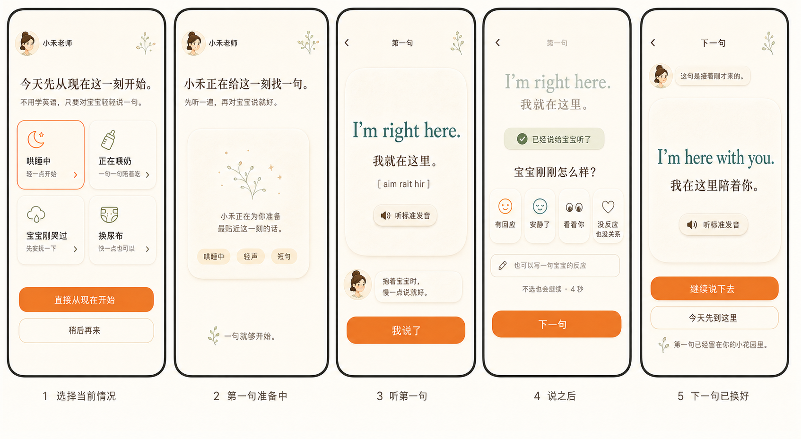
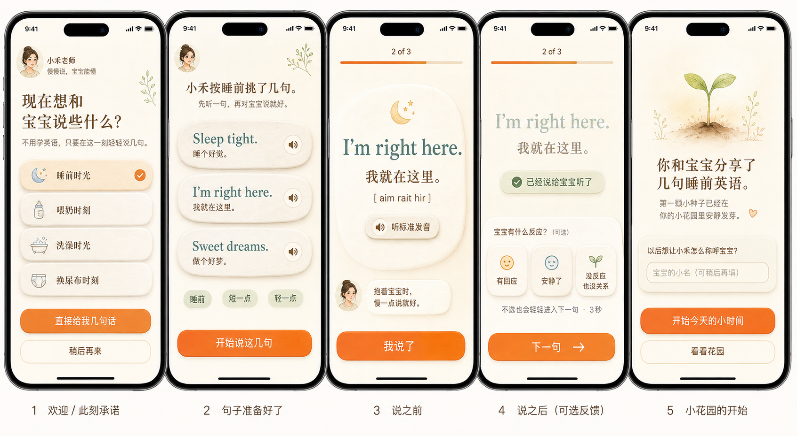
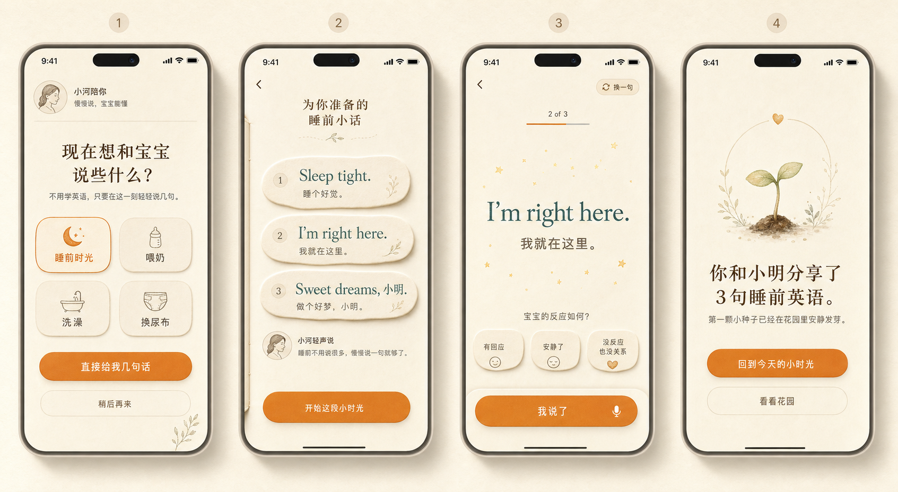
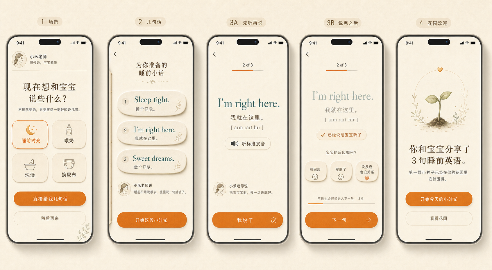

# 12_Onboarding_Screen

## 状态

Onboarding V4 设计规格。本文档是产品与交互设计规格，不是实现指南。

V4 替代 V3。V3 中的 `先给 3 句短语`、`完成固定短语组`、`2 of 3` 进度模型已经失效。

参考来源：
- `DESIGN.md`
- `docs/PRODUCT_COPILOT.md`
- `docs/design-spec/README.md`
- Baby Talk 2 Final Design Brief
- Home V4 已批准模型
- Onboarding V4 新生成原型图
- 已生成的 Onboarding 历史原型图

当前原型图：



历史视觉参考：



说明：
- V4 原型图用于表达核心流程、层级和视觉方向。
- V4 原型图中的头像、植物线稿、反应图标只作为视觉参考，不能从 PNG 裁切使用。
- V3 原型图只作为 Warm Paper Kindness 视觉风格参考。
- V3 原型图里的固定短语组交互不再作为实现依据。
- 本文档中的状态、跳转、数据契约优先级高于所有原型图。

## 1. 页面目标

Onboarding 的目标是让第一次打开 Baby Talk 2 的家长亲自体验产品承诺：

> 不是学英语，而是在和宝宝说话。

第一次体验必须证明 4 件事：
1. 家长可以从当前照护情境开始，不需要先学习课程。
2. 家长可以先听标准英语发音，再对宝宝说。
3. 家长说完后，可以选择性告诉小禾宝宝反应，也可以什么都不选。
4. 下一句会根据当前情境、刚才说过的话、宝宝信号继续生成，而不是来自固定 3 句短语组。

Onboarding 不能像：
- 注册流程；
- 英语水平测试；
- 课程选择；
- 打卡挑战；
- 儿童游戏；
- AI prompt 编辑器。

## 2. 用户进入场景

用户进入 Onboarding 的条件：
- 第一次打开 Baby Talk 2；
- 本地没有 `onboardingCompletedAt`；
- 本地没有完成过任何照护对话；
- 用户之前点过 `稍后再来` 后再次进入；
- 重新安装或清空本地资料。

首次进入时，以下资料可能为空：
- `babyNickname`
- `babyAgeMonths`
- `parentDisplayName`
- `householdId`
- `caregiverProfile`

资料为空时必须使用这些中性称呼：
- 宝宝称呼：`宝宝`
- 花园称呼：`你的小花园`
- 当前时刻称呼：`今天这一刻`
- 家长称呼：`妈妈`

禁止在资料为空时伪造昵称，例如 `小明`。

## 3. 用户心理状态

假设用户此刻：
- 对产品有兴趣，但不确定自己能不能自然说英语；
- 担心发音不标准；
- 可能一只手抱着宝宝；
- 不想再进入一个学习 App；
- 对分数、纠错、失败提示敏感；
- 只愿意先尝试一句。

Onboarding 必须回应：
- 低压力；
- 每屏只有一个主要动作；
- 不评分；
- 不录音；
- 不要求宝宝必须回应；
- 不要求填写宝宝名字或年龄；
- 让用户知道“一句就够开始”。

## 4. 页面内容优先级

P0：
- 说明产品不是学习英语，而是和宝宝说话；
- 让用户选择或接受一个当前照护情境；
- 进入 Practice 风格的第一句体验；
- 提供标准英语发音；
- 提供 `我说了`；
- 在 `我说了` 之后才出现宝宝信号；
- 根据上下文生成下一句；
- 允许用户继续说下去或温柔结束。

P1：
- 小禾用一句话解释为什么这个入口适合现在；
- `稍后再来` 退出，并保存进度；
- 第一次说完后留下花园痕迹；
- 最后提供可跳过的宝宝昵称输入。

P2：
- 网络慢或离线时使用本地安全入口和本地第一句；
- 回到 Home 后能看到 Home V4 的当下入口；
- 退出后可从 Home 继续。

P3：
- 年龄/月龄选择；
- 照护者邀请；
- 账号绑定；
- 成长分析；
- 花园完整说明。

## 5. 产品模型

Onboarding 使用“连续生成对话体验”模型，不使用固定短语组模型。

### 5.1 Onboarding 最小闭环

Onboarding 默认引导用户完成一个最小闭环：

1. 选择当前照护情境。
2. 进入第一句。
3. 听标准发音。
4. 对宝宝说。
5. 点 `我说了`。
6. 可选宝宝信号。
7. 小禾生成下一句。
8. 用户选择继续说下去，或先结束并进入 Home。

这个闭环不是 `2 句任务`，也不是 `固定 2 句组`。第二句必须由上下文生成。

### 5.2 首次情境入口

Onboarding 首屏展示 4 个情境入口，和 Home V4 保持同一产品模型。

默认入口：
1. `哄睡中`
2. `正在喂奶`
3. `宝宝刚哭过`
4. `换尿布`

默认推荐规则：
- 本地时间 19:00-04:59：推荐 `哄睡中`
- 本地时间 05:00-10:59：推荐 `正在喂奶`
- 本地时间 17:00-18:59：推荐 `哄睡中`
- 其他时间：推荐 `换尿布`

如果后端返回推荐入口，前端仍只显示 4 个入口。

### 5.3 进入 Practice 的上下文

用户点击情境入口后，Onboarding 发送给 Practice：

```json
{
  "entrySource": "onboarding_route",
  "routeId": "bedtime_soothing",
  "sceneType": "bedtime",
  "babySignal": null,
  "customSituationText": null,
  "resumeConversationId": null,
  "timeBand": "evening",
  "babyNickname": "宝宝",
  "babyAgeMonths": null,
  "parentTonePreference": "short_gentle",
  "recentSpokenPhraseIds": [],
  "onboardingMode": true
}
```

Practice 负责请求第一句英语短语和发音。Onboarding 首屏不请求短语组，也不展示英语短语。

### 5.4 下一句生成

用户点 `我说了` 后，下一句请求必须包含：

```json
{
  "conversationId": "conversation_id",
  "previousPhraseId": "phrase_id",
  "parentAction": "said_it",
  "babySignal": "calmed_down",
  "babySignalText": null,
  "sceneType": "bedtime",
  "babyNickname": "宝宝",
  "babyAgeMonths": null,
  "tone": "short_gentle"
}
```

如果用户没有选择宝宝信号，使用：

```json
{
  "babySignal": "unspecified",
  "babySignalText": null
}
```

不选择宝宝信号也是有效路径，不能被当成错误。

### 5.5 完成条件

Onboarding 可以在以下任一条件下标记完成：
- 用户在下一句出现后点 `继续说下去`；
- 用户在下一句出现后点 `今天先到这里`，并看到花园欢迎屏；
- 用户在花园欢迎屏点 `开始今天的小时间`；
- 用户在花园欢迎屏点 `看看花园`。

Onboarding 不能要求用户必须说满固定句数。

## 6. 用户操作流程

1. 欢迎与情境入口
   - 小禾说明“不是学英语，而是在和宝宝说话”。
   - 系统根据时间推荐一个情境。
   - 用户可以点任意情境入口，也可以点 `直接从现在开始`。

2. 第一句准备
   - App 进入 Practice 风格界面。
   - 后端根据情境生成第一句。
   - 如果 4 秒内未返回，使用本地安全第一句。

3. 说之前
   - 用户看到第一句英语、中文意思、标准发音按钮。
   - 用户可以点 `听标准发音`。
   - 用户对宝宝说完后点 `我说了`。

4. 说之后
   - 宝宝信号区出现。
   - 用户可以选择一个信号，也可以不选。
   - 选择信号后 500ms 进入下一句准备。
   - 不选信号时，4 秒后自动进入下一句准备。

5. 下一句出现
   - 小禾展示根据上下文生成的下一句。
   - 用户可以点 `继续说下去` 进入完整 Practice 连续对话。
   - 用户也可以点 `今天先到这里` 进入花园欢迎。

6. 花园欢迎
   - 展示第一句已经留下痕迹。
   - 显示可跳过昵称输入。
   - 用户进入 Home 或 Garden。

## 7. 原型屏幕状态与跳转说明

### Screen 1：欢迎 / 选择当前情况

可见状态：
- 小禾身份区。
- 标题：`今天先从现在这一刻开始。`
- 副文案：`不用学英语，只要对宝宝轻轻说一句。`
- 情境入口 4 个：
  - `哄睡中` / `轻一点开始`
  - `正在喂奶` / `一句一句陪着吃`
  - `宝宝刚哭过` / `先安抚一下`
  - `换尿布` / `快一点也可以`
- 一个推荐入口带橙色细边框。
- 主操作：`直接从现在开始`
- 退出操作：`稍后再来`

进入条件：
- 第一次打开 App。
- `onboardingCompletedAt` 为空。
- 没有正在进行的 onboarding 对话。

用户可操作：
- 点击一个情境入口：选中该入口，停留本屏。
- 点击 `直接从现在开始`：使用当前选中的入口进入 Screen 2。
- 点击 `稍后再来`：保存 `onboardingStatus = deferred`，进入 Home V4。

跳转：
- Screen 1 -> Screen 2：点击情境入口后再次确认，或点击 `直接从现在开始`。
- Screen 1 -> Home：点击 `稍后再来`。

### Screen 2：第一句准备中

可见状态：
- 标题：`小禾正在给这一刻找一句。`
- 副文案：`先听一遍，再对宝宝说就好。`
- 纸面加载区域，高度 220-260px。
- 不显示全屏 spinner。
- 不显示英语占位假文。
- 底部文案：`一句就够开始。`

进入条件：
- 用户在 Screen 1 选择了情境并开始。
- Practice 正在请求第一句。

用户可操作：
- 点击返回：回到 Screen 1。
- 等待：第一句返回后进入 Screen 3。

系统触发：
- 后端 4 秒内返回第一句：进入 Screen 3。
- 后端 4 秒未返回：使用本地安全第一句进入 Screen 3，并记录 `firstPhraseSource = local_fallback`。

跳转：
- Screen 2 -> Screen 3：第一句可用。
- Screen 2 -> Screen 1：点击返回。

### Screen 3：说之前 / 听第一句

可见状态：
- 顶部轻量标签：`第一句`
- 英语短语最大，例如：`I'm right here.`
- 中文意思：`我就在这里。`
- 音标辅助：`[ aim rait hir ]`
- 发音按钮：`听标准发音`
- 小禾提示：`抱着宝宝时，慢一点说就好。`
- 底部主操作：`我说了`
- 不显示宝宝反应区。

进入条件：
- Screen 2 已拿到第一句。
- 本地 fallback 第一句已准备好。

用户可操作：
- 点击 `听标准发音`：播放标准英语音频，停留本屏。
- 点击 `我说了`：记录第一句已说，进入 Screen 4。
- 点击返回：回到 Screen 1，并保留已选情境。

跳转：
- Screen 3 -> Screen 4：点击 `我说了`。
- Screen 3 -> Screen 1：点击返回。

### Screen 4：说之后 / 可选宝宝信号

可见状态：
- 当前英语短语透明度降到 55%。
- 确认提示：`已经说给宝宝听了`
- 文案：`宝宝刚刚怎么样？`
- 反应选项：
  - `有回应`
  - `安静了`
  - `看着你`
  - `没反应也没关系`
- 可选输入框：`也可以写一句宝宝的反应`
- 提示：`不选也会继续 · 4秒`
- 手动操作：`下一句`

进入条件：
- 用户在 Screen 3 点击 `我说了`。

用户可操作：
- 点击一个反应：选中 500ms 后进入 Screen 5。
- 输入宝宝反应并点击 `下一句`：进入 Screen 5。
- 不选择、不输入：4 秒后自动进入 Screen 5。
- 点击 `下一句`：不带反应进入 Screen 5。
- 点击返回：打开 ExitConfirmSheet。

数据规则：
- 选择 `有回应`：`babySignal = responded`
- 选择 `安静了`：`babySignal = calmed_down`
- 选择 `看着你`：`babySignal = looked_at_parent`
- 选择 `没反应也没关系`：`babySignal = no_visible_response`
- 不选择：`babySignal = unspecified`

跳转：
- Screen 4 -> Screen 5：选择反应、点 `下一句`、或等待 4 秒。
- Screen 4 -> ExitConfirmSheet：点击返回。

### Screen 5：下一句生成中

可见状态：
- 标题：`小禾正在接住刚才这一刻。`
- 副文案：`下一句会根据刚才的情况换一换。`
- 纸面加载区域。
- 不显示 `AI生成`。
- 不显示技术错误。

进入条件：
- Screen 4 已产生 `parentAction = said_it`。
- 已得到宝宝信号，或 4 秒自动使用 `unspecified`。

用户可操作：
- 等待：下一句返回后进入 Screen 6。
- 点击 `今天先到这里`：进入 Screen 7。
- 点击返回：打开 ExitConfirmSheet。

系统触发：
- 后端 6 秒内返回下一句：进入 Screen 6。
- 后端 6 秒未返回：使用本地安全下一句进入 Screen 6，并显示 `先用这一句也很好。`

跳转：
- Screen 5 -> Screen 6：下一句可用。
- Screen 5 -> Screen 7：点击 `今天先到这里`。
- Screen 5 -> ExitConfirmSheet：点击返回。

### Screen 6：下一句已经换好

可见状态：
- 顶部标签：`下一句`
- 小禾说明：`这句是接着刚才来的。`
- 英语短语最大，例如：`I'm here with you.`
- 中文意思：`我在这里陪着你。`
- 发音按钮：`听标准发音`
- 主操作：`继续说下去`
- 次操作：`今天先到这里`

进入条件：
- Screen 5 已拿到上下文生成的下一句，或本地 fallback 下一句。

用户可操作：
- 点击 `听标准发音`：播放标准英语音频，停留本屏。
- 点击 `继续说下去`：标记 onboarding 完成，进入完整 Practice 连续对话，当前句作为下一轮当前短语。
- 点击 `今天先到这里`：进入 Screen 7。
- 点击返回：打开 ExitConfirmSheet。

跳转：
- Screen 6 -> Practice：点击 `继续说下去`。
- Screen 6 -> Screen 7：点击 `今天先到这里`。
- Screen 6 -> ExitConfirmSheet：点击返回。

### Screen 7：小花园欢迎 / 温柔结束

可见状态：
- 标题：`第一句已经留在你的小花园里。`
- 副文案：`今天这一刻，已经开始了。`
- 可选昵称输入：`宝宝的小名（可稍后再填）`
- 主操作：`开始今天的小时间`
- 次操作：`看看花园`

进入条件：
- 用户在 Screen 5 或 Screen 6 点击 `今天先到这里`。
- 用户至少已经完成第一句 `我说了`。

用户可操作：
- 输入昵称：点击任一操作时保存昵称。
- 留空昵称：点击任一操作时不保存昵称，后续继续使用 `宝宝`。
- 点击 `开始今天的小时间`：标记 onboarding 完成，进入 Home V4。
- 点击 `看看花园`：标记 onboarding 完成，进入 Garden。

跳转：
- Screen 7 -> Home V4：点击主操作。
- Screen 7 -> Garden：点击次操作。

### ExitConfirmSheet：中途离开

可见状态：
- 标题：`要先停在这里吗？`
- 正文：`小禾会记住你刚才说到哪里。`
- 主操作：`继续`
- 次操作：`稍后再来`

进入条件：
- 用户在 Screen 4、Screen 5、Screen 6 点击返回。
- 用户在 onboarding 对话中触发关闭动作。

用户可操作：
- 点击 `继续`：关闭 sheet，回到打开 sheet 的屏幕。
- 点击 `稍后再来`：保存当前 onboarding 对话状态，进入 Home V4。
- 点击遮罩：关闭 sheet，回到打开 sheet 的屏幕。

保存字段：
- `onboardingStatus = deferred`
- `selectedRouteId`
- `conversationId`
- `lastPhraseId`
- `hasSaidFirstPhrase`
- `lastBabySignal`
- `updatedAt`

跳转：
- ExitConfirmSheet -> 原屏幕：点击 `继续` 或遮罩。
- ExitConfirmSheet -> Home V4：点击 `稍后再来`。

## 8. 组件清单

- OnboardingTopBar
- OnboardingPromiseBlock
- OnboardingRouteSelector
- OnboardingRouteTile
- FirstPhraseLoadingState
- OnboardingPhrasePanel
- StandardPronunciationControl
- SaidItActionBar
- BabySignalPanel
- NextPhraseLoadingState
- NextPhraseReadyPanel
- OnboardingGardenWelcome
- SkippableNicknameField
- ExitConfirmSheet

## 9. 组件细节

### OnboardingTopBar

用途：
- 建立小禾的成人导师身份。
- 告诉用户当前只需要做一个小动作。

规则：
- 小禾头像缺失时使用 `小禾` initials 圆形。
- 不使用儿童贴纸、卡通动物、表情符号。
- 文案不超过 16 个中文字符。

### OnboardingPromiseBlock

用途：
- 解释产品承诺。

固定文案：
- 标题：`今天先从现在这一刻开始。`
- 副文案：`不用学英语，只要对宝宝轻轻说一句。`

规则：
- 不出现 `课程`、`学习`、`挑战`、`打卡`、`测试`。
- 不使用超过 2 行的说明文字。

### OnboardingRouteSelector

用途：
- 让用户从当前照护情况开始。

规则：
- 显示 4 个入口。
- 布局为 2x2。
- 不是三列图标网格。
- 选中态只使用橙色细边框和一个小图标色。
- 点击入口只改变选中态，不立即进入下一屏；用户点 `直接从现在开始` 才进入 Screen 2。

### OnboardingPhrasePanel

用途：
- 显示当前要对宝宝说的这一句。

内容：
- 英语短语；
- 中文意思；
- 音标辅助；
- 标准发音按钮；
- 小禾一句提示。

规则：
- 英语短语是屏幕最大文字。
- 不显示短语列表。
- 不显示 `1/3`、`2 of 3`、`第 2 题`。
- 不显示 check box。

### StandardPronunciationControl

用途：
- 让用户先听标准发音。

规则：
- 只使用扬声器/播放图标。
- 文案为 `听标准发音`。
- 禁止 microphone、record、waveform。
- 禁止评分。

音频失败：
- 文案：`今天先看着读也可以。`
- 发音按钮 40% 透明度。
- `我说了` 仍可点击。

### SaidItActionBar

用途：
- 让用户告诉 App “我已经对宝宝说了”。

规则：
- 主按钮文案固定为 `我说了`。
- 不带麦克风图标。
- 不叫 `提交`、`完成练习`、`下一题`。
- 点击后才出现 BabySignalPanel。

### BabySignalPanel

用途：
- 让下一句更贴近宝宝刚才的状态。

规则：
- 只在 `我说了` 之后出现。
- 反应选择不是必填。
- 不选择时 4 秒自动继续。
- 选择后 500ms 自动继续。
- `没反应也没关系` 是正常选项，不是失败。

### NextPhraseReadyPanel

用途：
- 证明下一句来自上下文生成，而不是固定短语组。

规则：
- 必须出现说明：`这句是接着刚才来的。`
- 提供 `听标准发音`。
- 提供 `继续说下去` 和 `今天先到这里`。
- 不把用户困在 onboarding 中。

### OnboardingGardenWelcome

用途：
- 让第一次开口留下温柔结果。

规则：
- 不说 `获得奖励`、`完成任务`、`解锁`。
- 默认文案：`第一句已经留在你的小花园里。`
- 昵称输入可跳过。
- 不要求年龄。

## 10. 空状态

没有宝宝昵称：
- 使用 `宝宝`。
- 不伪造昵称。

没有家长姓名：
- 使用 `妈妈`。

没有网络：
- 首屏入口仍可用。
- 第一句和下一句使用本地安全短句。

没有小禾头像资产：
- 使用 initials 圆形 `小禾`。

## 11. 错误与降级状态

第一句生成超时：
- 4 秒后使用本地安全第一句。
- 文案：`先用这一句也很好。`
- 不显示 `生成失败`。

下一句生成超时：
- 6 秒后使用本地安全下一句。
- 文案：`先用这一句也很好。`
- 不中断 onboarding。

网络离线：
- 文案：`现在没联网，先用几句常用的话。`
- 不显示 AI/LLM 错误。

音频不可用：
- 文案：`今天先看着读也可以。`
- 不阻止 `我说了`。

用户中途退出：
- 保存当前状态。
- 进入 Home V4。
- Home 可根据 `onboardingStatus = deferred` 显示普通当下入口，不强迫继续 onboarding。

## 12. 数据契约与后端 / Practice 契约

Onboarding 不持有固定短语组。Onboarding 只负责收集首次情境和体验状态，第一句与下一句由 Practice 风格体验请求。

### 12.1 首次情境入口 payload

用户点击情境入口后发送给 Practice 风格体验：

```json
{
  "entrySource": "onboarding_route",
  "routeId": "bedtime_soothing",
  "sceneType": "bedtime",
  "babySignal": null,
  "babySignalText": null,
  "customSituationText": null,
  "resumeConversationId": null,
  "timeBand": "evening",
  "babyNickname": "宝宝",
  "babyAgeMonths": null,
  "parentTonePreference": "short_gentle",
  "recentSpokenPhraseIds": [],
  "onboardingMode": true
}
```

规则：
- `babyNickname = null` 时使用 `宝宝`。
- `babyAgeMonths = null` 时不显示年龄。
- Onboarding 首屏不请求短语组。
- Practice 风格体验负责请求第一句。

### 12.2 下一句请求

用户点击 `我说了` 并选择或跳过宝宝信号后发送：

```json
{
  "conversationId": "conversation_id",
  "previousPhraseId": "phrase_id",
  "parentAction": "said_it",
  "babySignal": "unspecified",
  "babySignalText": null,
  "sceneType": "bedtime",
  "babyNickname": "宝宝",
  "babyAgeMonths": null,
  "tone": "short_gentle",
  "onboardingMode": true
}
```

如果用户选择宝宝信号：

```json
{
  "babySignal": "calmed_down",
  "babySignalText": null
}
```

不选择宝宝信号是有效路径，不能记录为错误。

### 12.3 Onboarding 完成状态

Onboarding 完成后本地保存：

```json
{
  "onboardingCompletedAt": "2026-06-11T20:30:00+08:00",
  "firstConversationId": "conversation_id",
  "firstSceneType": "bedtime",
  "spokenPhraseCount": 1,
  "babyNickname": null
}
```

规则：
- 昵称为空时仍可完成。
- 年龄为空时仍可完成。
- 说过 1 句即可完成。
- 不要求固定 2 句或 3 句。

### 12.4 中途离开状态

用户点击 `稍后再来` 后本地保存：

```json
{
  "onboardingStatus": "deferred",
  "deferredAt": "2026-06-11T20:30:00+08:00",
  "lastScreen": "route_selection"
}
```

规则：
- 中途离开后进入 Home V4。
- Home 不强迫继续 onboarding。
- 下次打开可重新进入 Onboarding，也可继续使用 Home。

## 13. 原型历史

### V4 连续生成闭环原型


本次新生成原型用于表达 Onboarding V4 的已批准产品模型：
- 首屏显示 4 个当前照护情境入口，不显示英语短语列表。
- 第二屏是第一句准备中，不展示固定短语组。
- 第三屏才出现第一句英语、中文意思、音标和 `听标准发音`。
- 第四屏在 `我说了` 之后才出现宝宝反应。
- 第五屏展示上下文生成的下一句，并提供 `继续说下去` 和 `今天先到这里`。

实现注意：
- 原型中的反应图标可能显得偏表情化，实际实现必须使用第 17 节指定的 Flutter IconData。
- 原型中的小禾头像和植物线稿不是可用资产，实际实现必须遵守第 17 节 fallback 规则。
- 原型中所有文案以本文档的屏幕状态说明为准。

### V1 早期原型：需要纠正的问题



问题：
- 麦克风图标会让用户以为 App 要录音。
- `我说了` 和宝宝反应区同时出现，交互顺序不清。
- 系统未知宝宝昵称时就出现具体名字，不合理。
- 流程容易像“练习输入”，不是对宝宝说话。

### V2 已批准交互方向



保留结论：
- 使用 speaker/audio 控件表示标准发音。
- 不出现 microphone 或录音 UI。
- `我说了` 先出现。
- 宝宝反应只在 `我说了` 之后出现。
- 宝宝反应不是必填。
- 自动进入下一步，保护照护场景下的低操作成本。

### V3 视觉方向


保留结论：
- 暖纸色、温和留白、小禾导师感可保留。
- 英语短语排版风格可保留。
- 底部主操作区可保留。

废弃结论：
- 固定 3 句短语组。
- `开始说这几句`。
- `2 of 3` 进度。
- “完成固定短语组” 后进入花园。
- Onboarding 过渡到 Home V3 的短句推荐模型。

## 14. 视觉与动效要求

- 情境入口选中：120ms，scale 1.00 -> 0.98 -> 1.00。
- Screen 1 -> Screen 2：240ms 淡入。
- 第一句出现：280ms 淡入 + 8px 上移。
- `我说了`：确认提示 500ms，可使用轻微 opacity pulse。
- 反应选中：选中态停留 500ms 后进入下一步。
- 不选反应：反应区出现 4 秒后自动进入下一步。
- 下一句生成中：纸面 shimmer 周期 1200ms。
- 花园欢迎：如果没有正式 sprout 动画资产，只使用静态文字卡，不使用临时花朵动画。

禁止：
- 强弹跳；
- 分数动画；
- 奖励金币；
- 大面积彩带；
- 游戏化升级。

视觉规则：
- 背景使用 `--bg-base`。
- 卡片使用 `--bg-surface`。
- 英文短句使用 `--english`。
- 每屏最多 1 个暖橙色主按钮。
- 首屏情境入口不使用三列图标网格。
- 英文短句必须是 Screen 3 之后的最大文字。

## 15. 设计理由

Onboarding 不应该解释完整产品，而应该让用户完成一次真实的最小体验。

旧模型让用户以为 Baby Talk 2 是“给我 3 句，我照着练完”。新模型要让用户理解：Baby Talk 2 是“我在照护宝宝，小禾根据刚才发生的事情接着给下一句”。

因此 Onboarding 只需要证明连续生成循环成立，不需要让用户完成固定数量的句子。

## 16. AI 生成与设计检查要求

生成或 review Onboarding 图时必须满足：
- 竖屏手机，最大宽度 430px。
- 使用 Home V4 同一视觉系统。
- 首屏显示情境入口，不显示英语短语列表。
- 第一句进入 Practice 风格屏幕后才出现。
- 英语短语使用 Fraunces/Lora/Georgia 风格衬线体。
- 中文使用系统字体。
- 发音只用扬声器/播放图标。
- 不出现麦克风、录音、波形。
- 不出现评分、连续天数、积分、任务完成。
- 不出现固定 `3 句`、`2 of 3`、`固定短语组`。
- `我说了` 与宝宝反应不能同时作为初始状态出现。
- 宝宝反应只在 `我说了` 后出现。
- 不选择反应也能继续。

## 17. 图标与视觉资产清单

原型 PNG 参考：
- `docs/design-spec/assets/onboarding-v4-continuous-loop.png`
- `docs/design-spec/assets/onboarding-v3-moment-consistent.png`
- 历史参考：`onboarding-v1-early-prototype.png`
- 历史参考：`onboarding-v2-approved-interaction.png`

PNG 只作为视觉参考。禁止从 PNG 裁切头像、图标、植物线稿或花园插画。

| Asset ID | 用途 | 类型 | 本地路径或实现来源 | 尺寸 | 颜色规则 | 状态 | 必须处理方式 |
|----------|------|------|-------------------|------|----------|------|--------------|
| icon.nav.back | 返回按钮 | Flutter IconData | `Icons.arrow_back_ios_new` | 22px inside 44px target | `--text-primary` | available | 根据状态返回 Screen 1 或打开 ExitConfirmSheet。 |
| icon.audio.speaker | 标准发音 | Flutter IconData | `Icons.volume_up_outlined` | 20px inside 44px pill | `--text-primary` | available | 唯一发音图标；禁止麦克风、录音、波形。 |
| icon.route.moon | `哄睡中` | Flutter IconData | `Icons.nightlight_round` | 28px | 推荐入口用 `--accent-dark` | available | 不用 emoji。 |
| icon.route.bottle | `正在喂奶` | Flutter IconData | `Icons.local_drink_outlined` | 28px | `--text-secondary` | available | 后续可替换为批准 SVG。 |
| icon.route.soothing | `宝宝刚哭过` | Flutter IconData | `Icons.water_drop_outlined` | 28px | `--text-secondary` | available | 表达哭过，不使用夸张哭脸。 |
| icon.route.diaper | `换尿布` | Flutter IconData | `Icons.checkroom_outlined` | 28px | `--text-secondary` | available | 临时近似；最终资产后续统一解决。 |
| icon.reaction.responded | `有回应` | Flutter IconData | `Icons.sentiment_satisfied_alt_outlined` | 24px | selected `--success` | available | 不用 emoji。 |
| icon.reaction.calm | `安静了` | Flutter IconData | `Icons.self_improvement_outlined` | 24px | selected `--success` | available | 不用 emoji。 |
| icon.reaction.looked | `看着你` | Flutter IconData | `Icons.visibility_outlined` | 24px | selected `--success` | available | 不用眼睛 emoji。 |
| icon.reaction.no_visible_response | `没反应也没关系` | Flutter IconData | `Icons.eco_outlined` | 24px | selected `--success` | available | 表达温柔接受。 |
| illustration.xiaohe.avatar | 小禾头像 | SVG 或 PNG | `mobile/assets/illustrations/xiaohe_teacher_avatar.svg` | 40px | full color, no pure black | missing | 缺失时使用 initials 圆形 `小禾`。 |
| illustration.garden.sprout | 花园欢迎嫩芽 | SVG | `mobile/assets/illustrations/garden_sprout_seed.svg` | 144px x 144px | botanical green + warm brown | missing | 缺失时隐藏插画，只保留文字卡。 |
| animation.particles.seed | `我说了` 微粒 | Lottie 或 CustomPainter | `mobile/assets/lottie/seed_particles.json` | 500ms | `--accent-light`, `--success` | missing | 缺失时只做确认提示 opacity pulse。 |

## 18. 实现偏差风险

| 风险 | 影响 | 必须修正 |
|------|------|----------|
| 继续沿用 V3 的 3 句短语组。 | 用户会以为产品是固定短句练习。 | 删除短语预览卡和固定 `2 of 3` 进度；改为上下文生成下一句。 |
| Onboarding 首屏直接显示英语短语。 | 和 Home V4 的当下入口模型不一致。 | 首屏只显示情境入口；第一句进入 Practice 风格屏幕后显示。 |
| `我说了` 按钮带麦克风图标。 | 用户会误以为需要录音。 | `我说了` 不带麦克风；发音只用扬声器/播放。 |
| 宝宝反应和 `我说了` 同时出现。 | 用户不知道先说还是先选反应。 | 宝宝反应只能在 `我说了` 后出现。 |
| 不选宝宝反应无法继续。 | 照护场景操作负担太重。 | 4 秒自动继续，使用 `babySignal = unspecified`。 |
| 下一句来自本地固定第二句。 | 破坏“根据上下文继续生成”的核心模型。 | 下一句请求必须包含 previousPhraseId、parentAction、babySignal、sceneType。 |
| 昵称输入被设为必填。 | 低压力 onboarding 被打断。 | 昵称可留空，后续继续用 `宝宝`。 |
| 生成失败文案暴露 AI/LLM。 | 产品变成 AI 工具感。 | 使用 `先用这一句也很好。`，不显示技术错误。 |
| 缺失小禾头像时使用随机卡通头像。 | 视觉变儿童化。 | 使用 initials 圆形 `小禾`。 |

## 19. 文案规则与禁用清单

Onboarding 文案目标：
- 让第一次打开的家长知道这不是英语学习 App；
- 证明“一句就可以开始”；
- 不要求资料填写；
- 不制造跳过、失败或被评分的感受。

固定允许文案：
- `今天先从现在这一刻开始。`
- `不用学英语，只要对宝宝轻轻说一句。`
- `小禾正在为你准备最贴近这一刻的话。`
- `听标准发音`
- `我说了`
- `宝宝刚刚怎样？`
- `不选也会继续`
- `继续说下去`
- `今天先到这里`
- `稍后再来`
- `好的，宝宝的小花园等你。`
- `第一句已经留在你的小花园里。`

资料为空时：
- `babyNickname = null`：使用 `宝宝`。
- `parentDisplayName = null`：使用 `妈妈`。
- `babyAgeMonths = null`：不显示年龄，不提示必须填写。

禁止出现：
- `Skip`
- `跳过`
- `开始练习`
- `完成练习`
- `任务`
- `测试`
- `评分`
- `发音分`
- `正确`
- `错误`
- `失败`
- `没听清`
- `请重说`
- `AI生成`
- `LLM`
- `prompt`
- `模型`
- `固定 3 句`
- `2 of 3`

## 20. 与其他页面的关系

Home：
- Onboarding 完成后进入 Home V4。
- 中途点 `稍后再来` 后进入 Home V4。
- Home 不强迫继续 onboarding。
- Home 和 Onboarding 使用同一套情境入口模型。

Practice：
- Onboarding 的第一句体验复用 Practice V2 的核心循环。
- Onboarding 不实现独立固定短语组。
- 下一句请求字段必须和 Practice V2 兼容。

Garden：
- Onboarding 第一句说出后可以创建花园第一条痕迹。
- 花园欢迎只说明“留下痕迹”，不说奖励、解锁或积分。

Me：
- 宝宝昵称和年龄可以之后在 Me 中补充。
- Onboarding 不把昵称和年龄设为必填。

小禾：
- Onboarding 使用小禾作为温柔引导者。
- 小禾不提供长聊天，不解释 AI 机制。

## 21. 验收标准

实现完成后必须满足：

1. 首次进入 Onboarding 时，首屏显示情境入口，不显示英语短语列表。
2. 首屏固定显示 4 个情境入口。
3. `直接从现在开始` 或任一情境入口进入第一句准备状态。
4. 第一英文句出现时有 `听标准发音`，没有麦克风。
5. `我说了` 初始可见，宝宝反应初始不可见。
6. 点击 `我说了` 后才出现宝宝反应。
7. 用户不选择宝宝反应，4 秒后仍进入下一句准备。
8. 下一句请求包含 `previousPhraseId`、`parentAction`、`babySignal` 和 `sceneType`。
9. 用户说过 1 句即可完成 onboarding。
10. 宝宝昵称为空时全流程使用 `宝宝`，不显示伪造昵称。
11. 昵称输入可跳过，年龄不必填。
12. 点 `稍后再来` 后进入 Home，不显示 guilt 文案。
13. 全流程不出现 `Skip`、`跳过`、`评分`、`发音分`、`固定 3 句`、`2 of 3`。
14. 小禾头像和植物线稿未补资产前，使用文档指定 fallback，不从 PNG 裁切。
