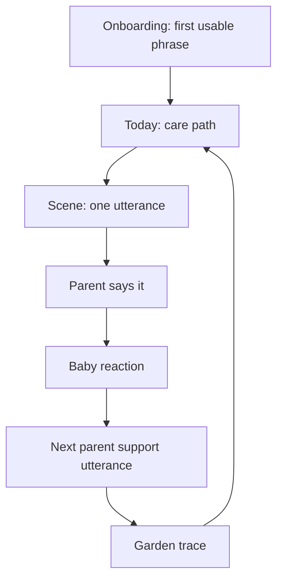
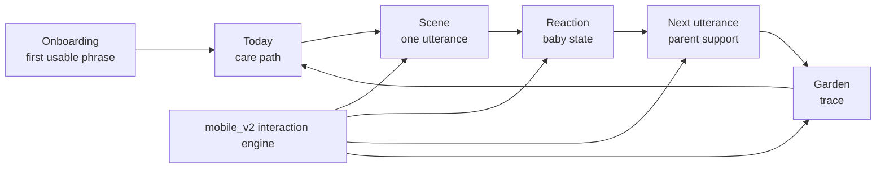
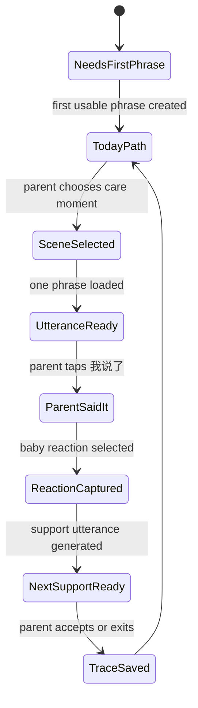
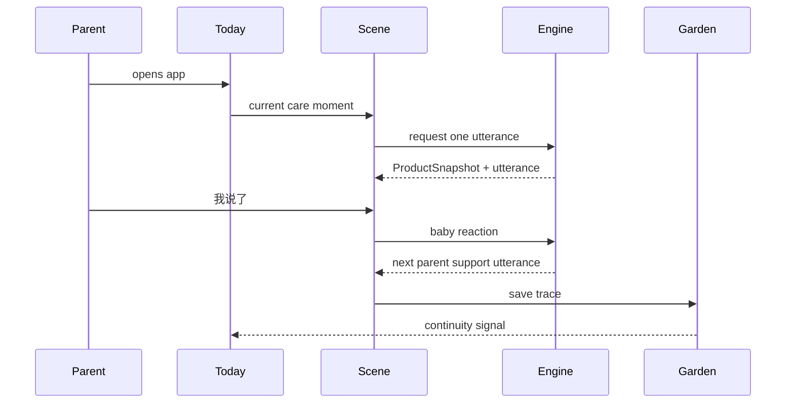
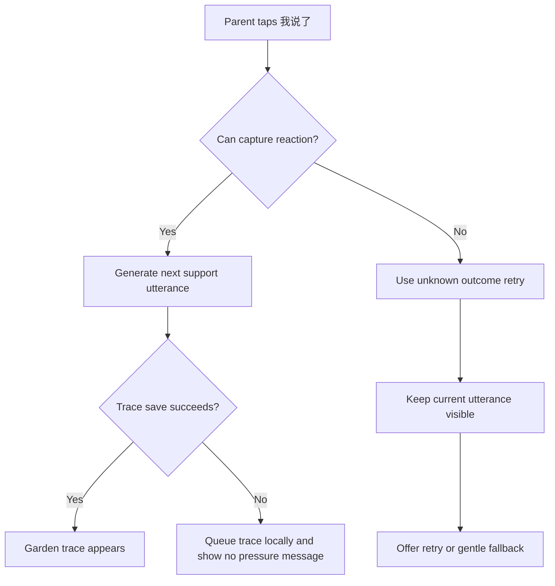

# BabyTalk Mobile Duolingo-like Care Path Design Contract

This document is the CEO review and strategic supersession record for the BabyTalk mobile direction. It supersedes conflicting mobile, mobile_v2, Practice, Discover, Garden, Growth, and Ritual Room direction where listed below.

## CEO Review Verdict

```text
批准 Duolingo-like care path 转向。
暂停 Ritual Room 视觉打磨。
mobile_v2 降级为 interaction engine / state architecture prototype。
下一步先落 supersession / CEO review 文档，不做 UI 实现。
```

The pivot is approved because the current mobile surface has become warm but structurally scattered. Duolingo's useful lesson is not its mascot, palette, XP economy, or course framing. Its useful product idea is that a returning user always understands the current path, the current node, and the next action. BabyTalk should translate that clarity into care moments, not into a language course.

The CEO decision is therefore:

```text
Approve: Duolingo-like information architecture.
Reject: Duolingo-like identity, gamification, lesson framing.
Freeze: Ritual Room visual polishing as a final direction.
Retain: mobile_v2 interaction/state architecture assets.
Build next: one minimal care-moment path loop only.
```

## Strategic Definition

BabyTalk is not a course app. BabyTalk is a parent companion that turns the care action a parent is already doing into one speakable English utterance.

The user's job is not:

```text
Learn English.
Complete lessons.
Train the child.
Maintain a streak.
Score a session.
```

The user's job is:

```text
I am changing a diaper, offering water, putting on shoes, bathing, or getting ready for bed.
What is one natural thing I can say to my baby right now?
```

This is the core product promise:

```text
BabyTalk helps a parent say the next caring sentence inside the moment they are already living.
```

## Duolingo Research Basis

This review uses Duolingo as a structural reference, not as a brand or content reference.
External Duolingo references are used only to identify information architecture patterns. They do not authorize visual copying, brand borrowing, gamification, or lesson framing.

Primary references:

- Duolingo learning path redesign: https://blog.duolingo.com/new-duolingo-home-screen-design/
- Duolingo core tabs refresh: https://blog.duolingo.com/core-tabs-redesign/
- Duolingo Practice Hub: https://blog.duolingo.com/guide-to-duolingo-practice-hub/
- Duolingo intermediate mini-units: https://blog.duolingo.com/intermediate-mini-units/
- Duolingo streak/habit mechanics: https://blog.duolingo.com/how-duolingo-streak-builds-habit/
- Duolingo brand identity and color: https://design.duolingo.com/identity/color
- Duolingo illustration shape language: https://design.duolingo.com/illustration/shape-language

What BabyTalk should borrow:

- A single dominant path instead of scattered cards.
- A clear current node instead of multiple competing entry points.
- One action at a time.
- Fast feedback that helps the next action.
- Long-term visible trace of use.
- Cleaner, more cohesive navigation.

What BabyTalk must not borrow:

- Duolingo green, mascot, illustration identity, or playful brand skin.
- XP, coins, leaderboards, pressure streaks, quests, leagues, or task completion economy.
- Course, lesson, unit, exercise, correctness, level, or "1 of 3" framing.
- Child-performance measurement.
- Parent guilt or obligation loops.

## Non-Negotiable Product Identity

BabyTalk must remain care-moment-first.

```text
BabyTalk = care action support.
BabyTalk != course product.
BabyTalk != parent homework.
BabyTalk != child performance tracker.
```

Every mobile screen must pass this test:

```text
Can a tired parent open this during a real care action and know what to say next?
```

If the screen mainly answers "what course should I complete" or "what progress did I achieve", it is off-strategy.

## Navigation Contract

The new bottom navigation is locked as:

```text
今天 / 场景 / 花园 / 我的
```

Tab responsibilities:

| Tab | Role | Not Allowed |
| --- | --- | --- |
| 今天 | Today's care path and current next moment | Dashboard clutter, stats-first layout, sync-first layout |
| 场景 | Browse/search/select care scenes and enter one utterance | Course catalog, lesson library, exercise bank |
| 花园 | Trace of real parent-child English moments and continuity | XP, coins, rankings, task completion, child performance |
| 我的 | Parent and baby profile, settings, preferences, archive | Daily growth pressure, main progress destination |

Navigation implications:

- `Growth` is no longer a main tab.
- `Discover` is superseded by `场景`.
- `Practice` may remain an internal implementation word temporarily, but it must not be a user-facing tab or primary label.
- `Garden` remains a main tab, but its meaning narrows to trace and continuity.
- `My` returns as a main tab because profile, baby settings, and household preferences need a stable home.

## Core Loop Contract

The new mobile loop is locked as:

```text
Onboarding first usable phrase
→ 今天照护小路
→ 场景里说一句
→ 宝宝反应
→ 下一句照护支持
→ 花园留下痕迹
```

In Chinese product language:

```text
先能说一句
→ 今天该说哪一句
→ 在真实场景里说一句
→ 看宝宝现在怎么反应
→ 给家长下一句照护支持
→ 把这个亲子英语时刻留在花园里
```

Mermaid overview:



The loop is intentionally small. It is the only implementation slice approved by this review.

## Onboarding Contract

Onboarding must stop behaving like setup before value. It must create the first usable phrase quickly.

Allowed onboarding inputs:

- Baby nickname or lightweight identity.
- Baby age range if it changes utterance tone.
- Common care scenes.
- Parent English comfort level.
- Optional household language preference.

Disallowed onboarding emphasis:

- Starter seed explanation.
- Local persistence explanation.
- Sync model explanation.
- Garden system explanation.
- Growth system explanation.
- Any lesson, course, or task setup.

`first win` is an internal product concept only. It is not user-facing copy.

Allowed user-facing copy examples:

```text
先试一句
现在就能说
给宝宝说一句
把这个时刻说出来
```

Forbidden user-facing copy examples:

```text
完成第一关
新手任务
课程
练习
第 1 课
1 of 3
答对
答错
完成任务
```

Banned words may appear in this document only inside explicit forbidden, example, context, or audit sections. User-facing copy and runtime surfaces must not use them; future grep-based verifiers should distinguish contract language from production copy.

## Today Care Path Contract

`今天` is the primary return surface. It replaces the current scattered Home model with a care path.

The page answers one question:

```text
我现在该说哪一句？
```

Approved structure:

- A visible care-moment path for the day.
- One dominant current moment node.
- One primary CTA, such as `现在说一句`.
- Nearby care moments that are easy to select, not equal-weight dashboards.
- Minimal status indicators only when they directly affect the next utterance.

Avoid:

- Account/local/sync status above the main action.
- Recent result cards competing with the current node.
- Multiple equal CTAs.
- Explaining the Garden or Growth systems on the Today page.
- Full-page marketing or tutorial content.

Candidate day path:

```text
早起 / 喝水 / 出门 / 午饭 / 洗澡 / 睡前
```

The path is not a curriculum sequence. It is a map of real care moments.

## Scene Contract

`场景` is the main browse and entry surface for care contexts.

It must support:

- Browse by common care action.
- Search for a care action.
- Resume the current care action.
- Enter one utterance quickly.
- Keep recent scenes available without turning them into completion history.

Scene examples:

```text
喝水
换尿布
穿鞋
洗澡
刷牙
睡前
出门
吃饭
安抚
收玩具
```

`场景` is preferred over `说一句` as a tab because it can hold browse, search, history, and scene selection. `说一句` remains useful as a CTA.

## One Utterance Screen Contract

The scene utterance screen uses one-screen-one-action discipline.

Approved information hierarchy:

```text
场景名称

English utterance
中文含义

When to say it

Listen

[我说了]
```

Example:

```text
喝水时间

Do you want some water?
你想喝点水吗？

现在递水杯时说

听一下

[我说了]
```

The screen must not show:

- Step count.
- Session count.
- Lesson title.
- Correctness state.
- Debug state such as `audio idle` or `saved`.
- Multiple next choices before the parent has acted.

## Baby Reaction Contract

The reaction prompt appears after the parent says the utterance.

Approved prompt:

```text
宝宝现在怎么了？
```

Approved reaction set:

```text
配合 / 犹豫 / 不想 / 没反应 / 其他
```

The reaction is not a score. It is context for the next parent support utterance.

## Next Utterance Logic Contract

The next utterance must be defined as:

```text
care action + baby reaction → parent support utterance
```

It must not be defined as:

```text
lesson step / exercise sequence / 1 of 3
```

Default logic:

| Baby Reaction | Product Meaning | Next Utterance Strategy |
| --- | --- | --- |
| 配合 | The care action can continue | Continue the natural next physical step |
| 犹豫 | The baby needs lower pressure | Offer choice, slow down, or narrate gently |
| 不想 | The baby is resisting | Name the feeling, reduce force, preserve connection |
| 没反应 | The signal was missed or too abstract | Repeat, simplify, or add a sensory cue |
| 其他 | The available reactions do not fit | Let parent describe the moment or choose a broader support path |

Example, `穿鞋`:

| Current State | Utterance |
| --- | --- |
| Initial | Let's put your shoes on. / 我们穿鞋吧。 |
| 配合 | One foot first. / 先穿一只脚。 |
| 犹豫 | Do you want this shoe or that shoe? / 你想要这只鞋还是那只鞋？ |
| 不想 | You don't want your shoes on yet. / 你还不想穿鞋。 |
| 没反应 | Shoes on, then we go outside. / 穿好鞋，我们就出去。 |
| 其他 | Tell me what happened. / 跟我说说刚才怎么了。 |

This is the central difference from Duolingo. Duolingo advances a learner through exercises. BabyTalk supports a parent inside an unfolding care interaction.

## Garden Contract

Garden stays, but it must not become a reward economy.

Garden means:

```text
真实亲子英语时刻留下的痕迹。
陪伴连续性的温柔记录。
```

Garden does not mean:

```text
家长完成了任务。
宝宝表现更好。
今天练习达标。
连续打卡压力。
```

Allowed Garden signals:

- A trace that a care moment happened.
- The phrase that was spoken.
- The scene context.
- Optional parent reflection.
- Gentle continuity across days.
- Memory-like growth of the garden as a record.

Forbidden Garden signals:

- XP.
- Coins.
- Leaderboards.
- Quests.
- Hard streak pressure.
- Completion count as success.
- Child performance scoring.
- Parent compliance scoring.

## Growth Contract

`Growth` is no longer a main tab.

Growth capabilities may survive in two places:

- `花园`: records and patterns from real parent-child English moments.
- `我的`: baby profile, age, preferences, household settings, and archived records.

Growth must not be a daily destination, and it must not pressure the parent to prove progress.

## mobile_v2 Supersession Contract

`mobile_v2 Ritual Room` is reclassified:

```text
mobile_v2 Ritual Room = interaction engine / state architecture prototype.
new mobile direction = care-moment path product architecture.
```

Superseded:

- Ritual Room as the final visual direction.
- Sentence light field as the primary mobile UI metaphor.
- Room-style visual polishing as the next product step.
- Golden-image iteration on Ritual Room as the leading design work.

Retained:

- Interaction Engine.
- ProductSnapshot.
- Reaction handling.
- Unknown outcome retry.
- Garden trace.
- Activation Governor.
- DTO to mapper to repository to domain to presentation separation.
- Semantic firewall against lesson, task, correctness, and pressure language.

Migration rule:

```text
Preserve the state machinery.
Replace the surface architecture.
Do not ship Ritual Room visuals as the main mobile answer.
```

## Duolingo Pattern Translation

| Duolingo Pattern | BabyTalk Translation | Boundary |
| --- | --- | --- |
| Learning path | 今日照护小路 | Path of care moments, not curriculum units |
| Lesson node | 真实照护时刻 | A real action like water, shoes, diaper, bath |
| Exercise | 现在能对宝宝说的一句 | One speakable parent utterance |
| Correct/wrong feedback | 宝宝反应与下一句照护支持 | No correctness, no scoring |
| Practice Hub | 场景 tab | Browse/search scenes, not exercises |
| Streak/quests/rewards | 花园痕迹与陪伴连续性 | No pressure mechanics |
| Core tabs refresh | 今天 / 场景 / 花园 / 我的 | Cleaner mobile IA, not brand mimicry |

## Conflict Coverage List

This section is the authoritative coverage table for old direction conflicts.

| Area | Existing Source | Keep | Covered By New Contract | Superseded or Deprecated |
| --- | --- | --- | --- | --- |
| Overall mobile identity | `DESIGN.md` says BabyTalk is parent-facing and not a task list | Keep parent-facing warmth and anti-pressure stance | Care-moment-first identity | Any interpretation that mobile is a broad learning/productivity dashboard |
| Duolingo stance | `docs/design-spec/README.md` says "not Duolingo" | Keep rejection of Duolingo identity and course framing | Duolingo-like IA only | Blanket rejection of Duolingo-like structure |
| Bottom nav | `DESIGN.md` and `README.md` mention Home/Discover/Garden/Growth or Home/Discover/Garden/Me variants | Keep need for stable bottom nav | `今天 / 场景 / 花园 / 我的` | `发现` as main tab, `成长` as main tab |
| Home | `docs/design-spec/06_Home_Screen.md` defines current moment entry and no phrase-card wall | Keep current-moment priority | Today care path with one current node | Multi-card Home, sync/status-first Home, recent-results-first Home |
| Discover | Older direction uses Discover for content exploration | Keep browse/search intent | `场景` tab | Discover as content feed or learning library |
| Practice | `docs/design-spec/07_Practice_Screen.md` and code use Practice surface | Keep phrase/audio/I said it/reaction/next support | Scene one utterance plus baby reaction | User-facing `Practice`, step count, session count, fixed sequence |
| Practice V2 anti-course rules | Practice V2 forbids fixed 3句, 2 of 4, achievement framing | Keep fully | Next utterance logic and banned language | Any future regression to lesson sequence |
| Garden | Existing Garden captures long-term record | Keep trace and memory | Garden trace and continuity | XP, coins, leaderboard, task completion, child performance |
| Growth | Existing Growth is a primary tab/section | Keep profile/record capabilities | Fold into Garden records or My baby profile | Growth as daily main tab |
| Onboarding | Current onboarding has setup and starter-seed/system explanation tendencies | Keep lightweight baby/context capture | First usable phrase | Setup-first onboarding, technical education before value |
| Ritual Room UI | Phase 41/42 Ritual Room docs and goldens define visual room direction | Keep only learnings that protect care semantics | Care-moment path architecture | Continued visual polishing as final direction |
| Ritual Room architecture | mobile_v2 has ProductSnapshot, reaction handling, unknown retry, Garden trace, Activation Governor | Keep and migrate | State foundation for new loop | Throwing away engine assets |
| Semantic firewall | Phase 39/40/41 guardrails forbid completion/streak/child performance | Keep and strengthen | Banned language list plus Garden contract | Any pressure or correctness language |
| Documentation hierarchy | Multiple docs currently conflict | Keep historical docs as archive/reference | This document is active supersession for conflicts | Treating older docs as equal authority where conflict exists |

## Source Of Truth Rule

When this document conflicts with older mobile design docs, this document wins for:

- Product architecture.
- Navigation.
- User-facing framing.
- Mobile_v2 Ritual Room status.
- Garden and Growth semantics.
- Initial implementation slice.

Older docs still apply where they do not conflict, especially for:

- Parent-facing warmth.
- Anti-pressure language.
- Accessibility expectations.
- Offline and local-first constraints.
- Existing domain language that avoids child performance.

## CEO Review Sections

### 1. Founder Thesis

Verdict: PASS.

The pivot is coherent because it reduces design dependency. BabyTalk does not need to invent a beautiful custom mobile structure from scratch. It needs an unmissable next action.

### 2. User Job

Verdict: PASS.

The user job is now concrete: help a parent speak one caring English sentence during a real care action.

### 3. Product Positioning

Verdict: PASS WITH BOUNDARY.

Duolingo-like IA is useful. Duolingo-like product identity is rejected.

### 4. Information Architecture

Verdict: PASS.

`今天 / 场景 / 花园 / 我的` is simpler than the previous Home/Practice/Discover/Garden/Growth spread.

### 5. Interaction Model

Verdict: PASS.

The loop moves from page collection to action loop:

```text
current care action → one utterance → baby reaction → next support → trace
```

### 6. Design Direction

Verdict: HOLD.

No UI implementation is approved by this review. Visual exploration must wait until the contract is accepted.

### 7. Gamification Risk

Verdict: HIGH RISK, MITIGATED BY CONTRACT.

The risk is that the team copies streaks, XP, levels, or completion language. This document forbids that direction.

### 8. Architecture Reuse

Verdict: PASS.

mobile_v2's interaction engine assets should be preserved as state capabilities beneath the new care path.

### 9. Scope Discipline

Verdict: PASS.

Only the minimal loop is approved. Full page rebuild is out of scope.

### 10. Documentation Conflict Handling

Verdict: PASS.

The conflict coverage table explicitly says which old directions remain valid and which are superseded.

### 11. Readiness For Implementation

Verdict: NOT YET.

This review approves the strategy and the next slice. Engineering and design implementation should begin only after this document is reviewed and accepted.

## Architecture Diagram



## State Machine



## Data Flow



## Error And Rescue Flow



## Error And Rescue Registry

| Risk | User Impact | Required Rescue |
| --- | --- | --- |
| No audio | Parent can still read and say phrase | Text remains primary, audio retry is secondary |
| Unknown baby outcome | Parent may not know which reaction fits | Offer `其他` and short description path |
| Next utterance unavailable | Loop stalls | Provide safe fallback utterance for same care action |
| Trace save failure | Garden continuity may be delayed | Queue locally, avoid blame or completion language |
| Parent picked wrong scene | Current phrase feels irrelevant | Easy scene switch, no penalty |
| Onboarding incomplete | First value delayed | Allow immediate sample phrase path |

## Failure Modes To Watch

| Failure Mode | Signal | Prevention |
| --- | --- | --- |
| Course drift | UI says lesson, practice, 1 of 3, complete | Banned language audit |
| Reward drift | Garden shows XP, coins, streak pressure | Garden contract review |
| Dashboard drift | Today has many equal cards and stats | One dominant current node |
| Engine loss | mobile_v2 assets are discarded | Architecture migration checklist |
| Visual overfitting | Duolingo palette or mascot-like skin appears | Brand boundary review |
| Overbuild | Team rebuilds all pages before loop works | Slice gate |

## Implementation Slice

Only this slice is approved after this document is reviewed:

```text
Onboarding first usable phrase
→ 今天小路
→ 场景一句
→ 宝宝反应
→ 下一句
→ 花园痕迹
```

Approved task sequence:

| ID | Task | Acceptance |
| --- | --- | --- |
| CEO-CP-01 | Update `docs/design-spec/README.md` or the relevant design-spec source-of-truth index to point to this contract as the active mobile supersession reference | Future agents can discover this contract before older Home/Practice/Discover/Garden/Growth/Ritual Room docs, and no active index claims the old nav as primary |
| CEO-CP-02 | Onboarding first usable phrase | Parent reaches one usable utterance without learning system setup |
| CEO-CP-03 | Today care path shell | One current node and one primary CTA dominate |
| CEO-CP-04 | Scene one utterance | Parent can pick a scene and see exactly one utterance |
| CEO-CP-05 | Baby reaction to next support | Reaction produces parent support, not lesson advancement |
| CEO-CP-06 | Garden trace | Spoken moment leaves a gentle trace without XP or pressure |

Explicitly out of scope:

- Full redesign of every mobile page.
- Ritual Room visual polish.
- New reward economy.
- Course library.
- Lesson sequencing.
- Leaderboards or quests.
- Growth main tab rebuild.
- Marketing landing page.

## Implementation Guardrails

Before any UI implementation, run these checks:

- Does the screen answer "what should I say right now?"
- Is there only one primary action?
- Does any copy imply course, practice, lesson, correctness, completion, or pressure?
- Does Garden show trace instead of achievement?
- Does the next utterance depend on care action and baby reaction?
- Are mobile_v2 state assets reused where appropriate?
- Is the slice still minimal?

## Review And Verification Plan

Required before implementation:

- Product acceptance of this supersession document.
- Engineering review of how mobile_v2 state assets migrate under the care path loop.
- Design review of first wireframe or prototype before building broad UI.
- Copy audit for banned lesson/gamification framing.
- Accessibility review for the one-utterance flow.

Required after implementation of the approved slice:

- Golden or screenshot verification for onboarding, Today, Scene, Reaction, Next, Garden trace.
- Text audit proving banned terms do not appear in user-facing surfaces.
- State test proving unknown outcome retry does not lose the current utterance.
- Trace test proving Garden records a moment without task completion semantics.

## Scope Accounting

```text
SCOPE_PROPOSED: 0
SCOPE_ACCEPTED: 0
SCOPE_DEFERRED: 0
IMPLEMENTATION_SCOPE_APPROVED_NOW: 0
DOCUMENTATION_SCOPE_APPROVED_NOW: 1
```

This review intentionally adds no implementation scope. It only defines the next approved implementation slice.

## Decision Log

| Decision | Status |
| --- | --- |
| Adopt Duolingo-like information architecture | Approved |
| Reject Duolingo-like identity | Approved |
| Reject gamification and lesson framing | Approved |
| Lock nav as 今天 / 场景 / 花园 / 我的 | Approved |
| Reclassify mobile_v2 Ritual Room as architecture prototype | Approved |
| Pause Ritual Room visual polishing | Approved |
| Preserve mobile_v2 engine assets | Approved |
| Fold Growth into Garden/My | Approved |
| Build only the minimal care loop next | Approved |

## Open Questions

These are not blockers for the supersession decision:

| Question | Why It Can Wait |
| --- | --- |
| Exact visual style of the Today path | Needs design review after strategy acceptance |
| Exact Garden trace metaphor | Must follow Garden contract, but visual form can vary |
| Whether internal code names should rename `Practice` immediately | Can be handled during implementation planning |
| Whether `场景` should include search on first slice | Search can be deferred if common scenes are enough |
| Exact offline persistence for traces | Existing local-first constraints and mobile_v2 assets can guide engineering review |

## Final CEO Readiness Dashboard

| Lane | Status | Notes |
| --- | --- | --- |
| Strategy | CLEAR | Direction is approved |
| Product identity | CLEAR | Care-moment-first, not course-first |
| Navigation | CLEAR | 今天 / 场景 / 花园 / 我的 |
| mobile_v2 disposition | CLEAR | UI superseded, state assets retained |
| Implementation | HOLD | Wait for document review |
| Design | HOLD | No visual implementation yet |
| Engineering | REVIEW NEEDED | Migration plan required before code |
| Risk | MANAGED | Main risk is lesson/gamification drift |

## GSTACK REVIEW REPORT

```text
REVIEW: BabyTalk Mobile Duolingo-like Care Path Strategic Supersession
SKILL: gstack-plan-ceo-review
MODE: HOLD_SCOPE
DATE: 2026-06-29

CRITICAL_GAPS: 0
UNRESOLVED_BLOCKERS: 0
IMPLEMENTATION_STARTED: NO
CODE_MODIFIED: NO

VERDICT:
CEO review is clear for documentation scope.
Strategy is approved.
Implementation remains on hold pending user review.

NEXT_ALLOWED_SLICE:
Onboarding first usable phrase
→ 今天小路
→ 场景一句
→ 宝宝反应
→ 下一句
→ 花园痕迹
```
